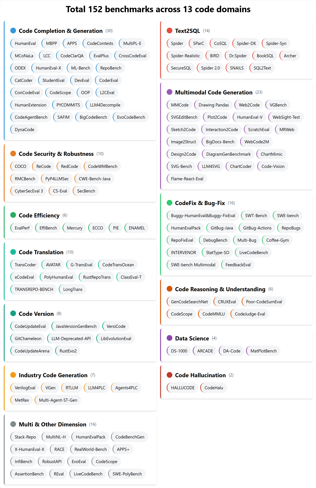

  <h1>👨‍💻 Awesome Code Benchmark</h1>
  
  

A comprehensive code domain benchmark review of LLM researches.

    

## News   
- 🔥🔥 [2025-05-20] **Featured Benchmarks**: 

  🔥 [Rethinking Repetition Problems of LLMs in Code Generation](https://arxiv.org/abs/2505.10402) from Peking University

  🔥 [WebGen-Bench: Evaluating LLMs on Generating Interactive and Functional Websites from Scratch](https://arxiv.org/abs/2505.03733) from Chinese University of Hong Kong

  🔥 [OmniGIRL: A Multilingual and Multimodal Benchmark for GitHub Issue Resolution](https://arxiv.org/abs/2505.04606)  from Sun Yat-sen University

  🔥 [CodeFlowBench: A Multi-turn, Iterative Benchmark for Complex Code Generation](https://arxiv.org/abs/2504.21751) from Peking University

  🔥 [Towards Mitigating API Hallucination in Code Generated by LLMs with Hierarchical Dependency Aware](http://export.arxiv.org/abs/2505.05057) from Harbin Institute of Technology, Shenzhen

  🔥 [CodeMixBench: Evaluating Large Language Models on Code Generation with Code-Mixed Prompts](https://arxiv.org/abs/2505.05063v1) from Chandigarh University

  🔥 [LongCodeBench: Evaluating Coding LLMs at 1M Context Windows](https://arxiv.org/abs/2505.07897)  from Panasonic AI Research

  🔥 [DecompileBench: A Comprehensive Benchmark for Evaluating Decompilers in Real-World Scenarios](https://arxiv.org/abs/2505.11340) from Tsinghua University

  🔥 [Improving Assembly Code Performance with Large Language Models via Reinforcement Learning](https://arxiv.org/abs/2505.11480) from Stanford University 

- 🔥🔥 [2025-05-01] **Featured Benchmarks**: 

  🔥 [aiXamine: Simplified LLM Safety and Security](https://arxiv.org/abs/2504.14985v2) from Qatar Computing Research Institute

  🔥 [SWE-PolyBench: A multi-language benchmark for repository level evaluation of coding agents](https://arxiv.org/abs/2504.08703) from AWS AI Labs

  🔥 [CRUST-Bench: A Comprehensive Benchmark for C-to-safe-Rust Transpilation](https://arxiv.org/abs/2504.15254) from The University of Texas at Austin 

  🔥 [LeetCodeDataset: A Temporal Dataset for Robust Evaluation and Efficient Training of Code LLMs](https://arxiv.org/abs/2504.14655) 

  🔥 [Paper2Code: Automating Code Generation from Scientific Papers in Machine Learning](https://arxiv.org/abs/2504.17192) from KAIST

  🔥 [CoCo-Bench: A Comprehensive Code Benchmark For Multi-task Large Language Model Evaluation](https://arxiv.org/abs/2504.20673) from Peking University
  
-  [2025-04-18] We add **Github Stars** for each banchmark.
-  [2025-04-13] We add **Code Security & Robustness** benchmarks.  
-  [2025-04-06] We add **Code Hallucinations** benchmarks.  
-  [2025-03-29] We have crawled all the articles related to code benchmarks in the **past five years**.  
-  [2025-03-17] We add **Code Version** (Version-specific code generation) benchmarks.  
-  [2025-03-16] A thorough review of code domain benchmarks for LLM research has been released.  

## Table of Content

- [Code Completion & Code Generation](#code-completion--code-generation)
- [Code Efficiency](#code-efficiency)
- [CodeFix & Bug-Fix](#codefix--bug-fix)
- [Code Reasoning & Understanding](#code-reasoning--understanding)
- [Code Hallucination](#code-hallucination)
- [Data science](#data-science)
- [Text2SQL](#text2sql)
- [MultiModal Code Tasks](#multimodal-code-tasks)
- [Code Security & Robustness](#code-security--robustness)
- [Code Translation](#code-translation)
- [Code Version](#code-version)
- [Multi & Other Dimension](#multi--other-dimension)
- [Industry Code Generation](#industry-code-generation)

## Survey

1. [Software Development Life Cycle Perspective A Survey of Benchmarks for Code Large Language Models and Agents](https://arxiv.org/abs/2505.05283v2) from Xi’an Jiaotong University

2. [Assessing and Advancing Benchmarks for Evaluating Large Language Models in Software Engineering Tasks](https://arxiv.org/abs/2505.08903) from Zhejiang University

## 🚀 Top Code Benchmark

### Code Completion & Code Generation

| Benchmark | Paper | Date | Github | Dataset & Website & LeaderBoard |
|:--|:--|:--|:--|:--|
| HumanEval                     | [Evaluating Large Language Models Trained on Code](https://arxiv.org/abs/2107.03374)                                                                                          | Arxiv 2021/07       | [Github](https://github.com/openai/human-eval)                               | [🤗Dataset](https://huggingface.co/datasets/openai/openai_humaneval) |
| MBPP                          | [Program Synthesis with Large Language Models](https://arxiv.org/abs/2108.07732)                                                                                              | Arxiv 2021/08       | [Github](https://github.com/google-research/google-research/tree/master/mbpp)                               |  [🤗Dataset](https://huggingface.co/datasets/google-research-datasets/mbpp) |
| APPS                          | [Measuring Coding Challenge Competence With APPS](https://arxiv.org/abs/2105.09938)                                                                                           | NeurIPS 2021        | [Github](https://github.com/hendrycks/apps)                                        | [🤗Dataset](https://huggingface.co/datasets/codeparrot/apps) |
| CodeContests                  | [Competition-Level Code Generation with AlphaCode](https://arxiv.org/abs/2203.07814)                                                                                          | Science 2022        | [Github](https://github.com/google-deepmind/code_contests)   | [Dataset](https://github.com/google-deepmind/code_contests)|
| MultiPL-E                     | [MultiPL-E: A Scalable and Polyglot Approach to Benchmarking Neural Code Generation](https://ieeexplore.ieee.org/abstract/document/10103177)                                  | TSE 2023            | [Github](https://github.com/nuprl/MultiPL-E)                                      | [🤗Dataset](https://huggingface.co/datasets/nuprl/MultiPL-E) |
| MCoNaLa                       | [MCoNaLa: A Benchmark for Code Generation from Multiple Natural Languages](https://arxiv.org/abs/2203.08388)                                                                  | EACL 2023 Findings  | [Github](https://github.com/zorazrw/multilingual-conala)  | [🤗Dataset](https://huggingface.co/datasets/neulab/mconala) |
| LCC                           | [LongCoder: A Long-Range Pre-trained Language Model for Code Completion](https://arxiv.org/abs/2306.14893)                                                                    | ICML 2023           | [Github](https://github.com/microsoft/CodeBERT/tree/master/LongCoder)    | [Dataset](https://github.com/microsoft/CodeBERT/tree/master/LongCoder) |
| CodeClarQA                    | [Python Code Generation by Asking Clarification Questions](https://arxiv.org/abs/2212.09885v2)                                                                                | ACL 2023            | [Github](https://github.com/UKPLab/codeclarqa)                                | [Dataset](https://drive.google.com/file/d/1bM-b-L10vNpk7Onyft9BXK8GlMIGl52q/view?usp=sharing) |
| EvalPlus                      | [Is Your Code Generated by Chat{GPT} Really Correct? Rigorous Evaluation of Large Language Models for Code Generation](https://arxiv.org/abs/2305.01210)                      | NeurIPS 2023        | [Github](https://github.com/evalplus/evalplus)                                | [🤗Dataset](https://huggingface.co/evalplus) [📊LeaderBoard](https://evalplus.github.io/leaderboard.html)|
| CrossCodeEval                 | [CrossCodeEval: A Diverse and Multilingual Benchmark for Cross-File Code Completion](https://arxiv.org/abs/2310.11248)                                                        | NeurIPS 2023        | [Github](https://github.com/amazon-science/cceval)                    | [Dataset](https://github.com/amazon-science/cceval/tree/main/data) |
| ODEX                          | [Execution-Based Evaluation for Open-Domain Code Generation](https://arxiv.org/abs/2212.10481)                                                                                | EMNLP 2023 Findings | [Github](https://github.com/zorazrw/odex)    | [Dataset](https://github.com/zorazrw/odex) |
| HumanEval-X                   | [CodeGeeX: A Pre-Trained Model for Code Generation with Multilingual Benchmarking on HumanEval-X](https://arxiv.org/abs/2303.17568)                                           | SIGKDD 2023         | [Github](https://github.com/THUDM/CodeGeeX)  | [Dataset](https://github.com/THUDM/CodeGeeX/tree/main/codegeex/benchmark) |
| ML-Bench                      | [ML-Bench: Evaluating Large Language Models and Agents for Machine Learning Tasks on Repository-Level Code](https://arxiv.org/abs/2311.09835)                                 | Arxiv 2023/11       | [Github](https://github.com/gersteinlab/ML-bench)   | [🤗Dataset](https://huggingface.co/datasets/super-dainiu/ml-bench) [🌐Website](https://ml-bench.github.io/)|
| RepoBench                     | [RepoBench: Benchmarking Repository-Level Code Auto-Completion Systems](https://arxiv.org/abs/2306.03091)                                                                     | ICLR 2024           | [Github](https://github.com/Leolty/repobench)   | [🤗Dataset](https://huggingface.co/tianyang) |
| CatCoder                      | [Enhancing Repository-Level Code Generation with Integrated Contextual Information](https://arxiv.org/abs/2406.03283)                                                         | Arxiv 2024/06       | | |
| StudentEval                   | [StudentEval: A Benchmark of Student-Written Prompts for Large Language Models of Code](https://arxiv.org/abs/2306.04556)                                                     | ACL 2024 Findings   | [Github](https://github.com/Wellesley-EASEL-lab/StudentEval) | [🤗Dataset](https://huggingface.co/datasets/wellesley-easel/StudentEval) |
| DevEval                       | [DevEval: A Manually-Annotated Code Generation Benchmark Aligned with Real-World Code Repositories](https://arxiv.org/abs/2405.19856)                                         | ACL 2024            | [Github](https://github.com/seketeam/DevEval)                                | [🤗Dataset](https://huggingface.co/datasets/LJ0815/DevEval/blob/main/Source_Code.tar.gz)|
| CoderEval                     | [CoderEval: A Benchmark of Pragmatic Code Generation with Generative Pre-trained Models](https://arxiv.org/abs/2302.00288)                                                    | ICSE 2024           | [Github](https://github.com/CoderEval/CoderEval)  |   |
| ConCodeEval                   | [ConCodeEval: Evaluating Large Language Models for Code Constraints in Domain-Specific Languages](https://arxiv.org/abs/2407.03387)                                           | Arxiv 2024/07       | | |
| CodeScope                     | [CodeScope: An Execution-based Multilingual Multitask Multidimensional Benchmark for Evaluating LLMs on Code Understanding and Generation](https://arxiv.org/abs/2311.08588)  | ACL 2024            | [Github](https://github.com/WeixiangYAN/CodeScope) | [📊LeaderBoard](https://haitianliu22.github.io/code-scope-benchmark/)  [🤗Dataset](https://huggingface.co/datasets/WeixiangYan/CodeScope) |
| OOP                           | [OOP: Object-Oriented Programming Evaluation Benchmark for Large Language Models](https://arxiv.org/abs/2401.06628)                                                           | ACL 2024 Findings   | [Github](https://github.com/alphadl/OOP-eval)   | [🤗Dataset](https://huggingface.co/datasets/codeai-dteam/oop)         |
| L2CEval                       | [L2CEval: Evaluating Language-to-Code Generation Capabilities of Large Language Models](https://arxiv.org/abs/2309.17446)                                                     | TACL 2024           | | |
| HumanExtension                | [Exploring Language Model's Code Generation Ability with Auxiliary Functions](https://arxiv.org/abs/2403.10575)                                                               | NAACL 2024 Findings | [Github](https://github.com/sh0416/humanextension)  | [🤗Dataset](https://huggingface.co/datasets/sh0416/humanextension) |
| LLM4Decompile                 | [LLM4Decompile: Decompiling Binary Code with Large Language Models](https://arxiv.org/abs/2403.05286)                                                                         | EMNLP 2024          | [Github](https://github.com/albertan017/LLM4Decompile) | [🤗Dataset](https://huggingface.co/datasets/LLM4Binary/decompile-ghidra-100k)|
| PYCOMMITS                     | [Coeditor: Leveraging Contextual Changes for Multi-round Code Auto-editing](https://arxiv.org/abs/2305.18584)                                                                 | ICLR 2024           | [Github](https://github.com/MrVPlusOne/Coeditor)  | [Dataset](https://github.com/MrVPlusOne/Coeditor) |
| CodeAgentBench                | [CodeAgent: Enhancing Code Generation with Tool-Integrated Agent Systems for Real-World Repo-level Coding Challenges](https://arxiv.org/abs/2401.07339)                       | ACL 2024            | | |
| SAFIM                         | [Evaluation of LLMs on Syntax-Aware Code Fill-in-the-Middle Tasks](https://arxiv.org/abs/2403.04814)                                                                          | ICML 2024           | [Github](https://github.com/gonglinyuan/safim)   | [🤗Dataset](https://huggingface.co/datasets/gonglinyuan/safim) |
| BigCodeBench                  | [BigCodeBench: Benchmarking Code Generation with Diverse Function Calls and Complex Instructions](https://arxiv.org/abs/2406.15877)                                           | ICLR 2025           | [Github](https://github.com/bigcode-project/bigcodebench) | [🤗Dataset](https://huggingface.co/collections/bigcode/bigcodebench-666ed21a5039c618e608ab06) [📊LeaderBoard](https://huggingface.co/spaces/bigcode/bigcodebench-leaderboard) |
| EvoCodeBench                  | [EvoCodeBench: An Evolving Code Generation Benchmark Aligned with Real-World Code Repositories](https://arxiv.org/abs/2404.00599)                                             | NeurIPS 2025        | [Github](https://github.com/seketeam/EvoCodeBench)  | [🤗Dataset](https://huggingface.co/datasets/LJ0815/EvoCodeBench) |
| DynaCode                      | [DynaCode: A Dynamic Complexity-Aware Code Benchmark for Evaluating Large Language Models in Code Generation](https://arxiv.org/abs/2503.10452)                               | Arxiv 2025/03       | | |
||                               | [A Large-scale Class-level Benchmark Dataset for Code Generation with LLMs](https://arxiv.org/abs/2504.15564)                                                                 | EASE 2025           ||
| LeetCodeDataset               | [LeetCodeDataset: A Temporal Dataset for Robust Evaluation and Efficient Training of Code LLMs](https://arxiv.org/abs/2504.14655)                                             | Arxiv 2025/04       | [Github](https://github.com/newfacade/LeetCodeDataset)  | [🤗Dataset](https://huggingface.co/datasets/newfacade/LeetCodeDataset) |
| CodeFlowBench                 | [CodeFlowBench: A Multi-turn, Iterative Benchmark for Complex Code Generation](https://arxiv.org/abs/2504.21751)                                                              | Arxiv 2025/04       | [Github](https://github.com/Rise-1210/codeflow) | [🤗Dataset](https://huggingface.co/datasets/WaterWang-001/CodeFlowBench-2505) |
| CodeMixBench                  | [CodeMixBench: Evaluating Large Language Models on Code Generation with Code-Mixed Prompts](https://arxiv.org/abs/2505.05063v1)                                               | Arxiv 2025/05       | | [🤗Dataset](https://huggingface.co/datasets/ColdSlim/CodeMixBench) |
| CLEVER | [CLEVER:A Curated Benchmark for Formally Verified](https://arxiv.org/abs/2505.13938) | Arxiv 2025/05 | [Github](https://github.com/trishullab/clever) | [🤗Dataset](https://huggingface.co/datasets/amitayusht/clever) |
| OSS-Bench | [OSS-Bench: Benchmark Generator for Coding LLMs](https://arxiv.org/abs/2505.12331) | Arxiv 2025/05 | [Github](https://github.com/oss-bench/oss-bench)  | [🤗Dataset]([0599jiangyc/oss-bench · Datasets at Hugging Face](https://huggingface.co/datasets/0599jiangyc/oss-bench))[📊LeaderBoard]([OSS-Bench](https://oss-bench.github.io/)) |

Details of Code Completion & Code Generation Benchmarks  <i>:: click to expand ::</i>

* **HumanEval**: code completion 
* **MBPP**: text -> code; code generation 
* **APPS**: a benchmark for code generation from natural language specifications
* **CodeContests**: complex programming task
* **MultiPL-E**: extends the HumanEval and MBPP benchmarks to 18 languages
* **MCoNaLa**: code generation from multiple natural languages
* **LCC**: long code context code completion
* **CodeClarQA**: containing pairs of natural language descriptions and code with created synthetic clarification questions and answers.
* **EvalPlus**: extends the HumanEval and MBPP benchmarks
* **CrossCodeEval**: diverse and multilingual benchmark for cross-file code completion
* **ODEX**: open-domain, execution-based natural language to code generation
* **HumanEval-X**: multilingual ability of code generation 
* **ML-Bench**: repo-level ML task solving benchmark using real-world code
* **RepoBench**: repo-level code auto-completion
* **CatCoder**: a framework for repo-level code generation in statically typed languages using code and type context
* **StudentEval**: a benchmark of student-written prompts for code generation evaluation
* **DevEval**: repo-level code generation
* **CoderEval**: pragmatic code generation
* **ConCodeEval**: benchmark for assessing LLMs' understanding of code constraints in domain-specific languages like JSON and YAML
* **CodeScope**: Multilingual Multitask Multidimensional Benchmark (execution-based)
* **OOP**: object-oriented programming evaluation benchmark of python programs
* **L2CEval**: multilingual, multi-task NL-to-code benchmark including semantic parsing, math reasoning and Python programming.
* **HumanExtension**：auxiliary-function-based code generation benchmark
* **LLM4Decompile**: benchmark for evaluating binary-to-C decompilation on real-world open-source binaries
* **PYCOMMITS**: multi-round Python code editing benchmark from real commit histories
* **CodeAgentBench**: repo-level code generation benchmark with tool-integrated agents for real-world tasks
* **SAFIM**: syntax-aware code completion benchmark focusing on code blocks and conditional expressions​
* **BigCodeBench**: complete Split & Instruct Split
* **EvoCodeBench**: evolving Python code generation benchmark from real GitHub commits
* **DynaCode**: a dynamic complexity-aware code benchmark
* **CLEVER**:A Lean-based benchmark for verified code generation, where models must synthesize provably correct code from hidden specs
* **OSS-Bench**:a benchmark for evaluating code generation capabilities of Large Language Models (LLMs) in real-world software development scenarios

### Code Efficiency

| Benchmark | Paper | Date | Github | Dataset & Website & LeaderBoard |
|:--|:--|:--|:--|:--|
| EvalPerf      | [Evaluating Language Models for Efficient Code Generation](https://arxiv.org/abs/2408.06450)                                          | COLM 2024                   | [Github](https://github.com/evalplus/evalplus)               | [🤗Dataset](https://huggingface.co/datasets/evalplus/evalperf) [🌐Website](https://evalplus.github.io/evalperf.html)|
| EffiBench     | [EffiBench: Benchmarking the Efficiency of Automatically Generated Code](https://arxiv.org/abs/2402.02037)                            | NeurIPS 2024                | [Github](https://github.com/huangd1999/EffiBench)      |  |
| Mercury       | [Mercury: A Code Efficiency Benchmark for Code Large Language Models](https://arxiv.org/abs/2402.07844v4)                             | NeurIPS 2024                | [Github](https://github.com/Elfsong/Mercury)          | [🤗Dataset](https://huggingface.co/datasets/Elfsong/Mercury) |
| ECCO          | [ECCO: Can We Improve Model-Generated Code Efficiency Without Sacrificing Functional Correctness?](https://arxiv.org/abs/2407.14044)  | EMNLP 2024                  | [Github](https://github.com/CodeEff/ECCO)             | [🤗Dataset](https://huggingface.co/datasets/CodeEff/ECCO)|
| PIE           | [Learning Performance-Improving Code Edits](https://arxiv.org/abs/2302.07867)                                                         | ICLR 2024                   | [Github](https://github.com/LearningOpt/pie)          | [🌐Website](https://pie4perf.com)|
| ENAMEL        | [How Efficient is LLM-Generated Code? A Rigorous & High-Standard Benchmark](https://arxiv.org/abs/2406.06647)                         | ICLR 2025                   | [Github](https://github.com/q-rz/enamel)              | [🤗Dataset](https://huggingface.co/datasets/q-rz/enamel) |
|               | [Improving Assembly Code Performance with Large Language Models via Reinforcement Learning](https://arxiv.org/abs/2505.11480)         | Arxiv 2025/05               |||
| EFFIBENCH-X | [EFFIBENCH-X:A Multi-Language Benchmark forMeasuring Effciency ofLLM.Generated Code](https://arxiv.org/abs/2505.13004) | Arxiv 2025/05 |[Github](https://github.com/EffiBench/EffiBench-X)   |[🤗Dataset](https://huggingface.co/datasets/EffiBench/effibench-x)|

### CodeFix & Bug-Fix

| Benchmark | Paper | Date | Github | Dataset & Website & LeaderBoard |
|:--|:--|:--|:--|:--|
| Buggy-HumanEval&Buggy-FixEval | [Large Language Models of Code Fail at Completing Code with Potential Bugs](https://arxiv.org/abs/2306.03438)                                     | NeurIPS 2023               | [Github](https://github.com/amazon-science/buggy-code-completion) | [Dataset](https://github.com/amazon-science/buggy-code-completion) |
| SWT-Bench                     | [SWT-Bench: Testing and Validating Real-World Bug-Fixes with Code Agents](https://arxiv.org/abs/2406.12952)                                       | NeurIPS 2024               | [Github](https://github.com/logic-star-ai/SWT-Bench)            | [🌐Website](https://swtbench.com) |
| HumanEvalPack                 | [OctoPack: Instruction Tuning Code Large Language Models](https://arxiv.org/abs/2308.07124)                                                       | ICLR 2024                  | [Github](https://github.com/bigcode-project/octopack)         | [🤗Dataset](https://huggingface.co/datasets/bigcode/humanevalpack) |
| SWE-bench                     | [SWE-bench: Can Language Models Resolve Real-World GitHub Issues?](https://arxiv.org/abs/2310.06770)                                              | ICLR 2024                  | [Github](https://github.com/swe-bench/SWE-bench)                       | [🌐Website](https://www.swebench.com) |
| GitBug-Java                   | [GitBug-Java: A Reproducible Benchmark of Recent Java Bugs](https://arxiv.org/abs/2402.02961v2)                                                   | MSR 2024                   | [Github](https://github.com/gitbugactions/gitbug-java)     |  [🤗Dataset](https://huggingface.co/datasets/gitbugactions/gitbug-java) [🌐Website](https://nuno.saavedra.pt/gitbug-java#!/) |
| GitBug-Actions                | [GitBug-Actions: Building Reproducible Bug-Fix Benchmarks with GitHub Actions](https://arxiv.org/abs/2310.15642)                                  | ICSE 2024 Demo             | [Github](https://github.com/gitbugactions/gitbugactions)  | [▶️Video](https://www.youtube.com/watch?v=aBWwa1sJYBs) |
| RepoBugs                      | [When Large Language Models Confront Repository-Level Automatic Program Repair: How Well They Done?](https://arxiv.org/abs/2403.00448)            | ICSE 2024 Industry Track   | | |
| RepoFixEval                   | [RepoFixEval: A Repository-Level Program Repair Benchmark From Issue Discovering to Bug Fixing](https://openreview.net/pdf?id=LaNCeNmoHR)         | OpenReview 2024            | [Link](https://openreview.net/forum?id=LaNCeNmoHR)| |
| DebugBench                    | [DebugBench: Evaluating Debugging Capability of Large Language Models](https://arxiv.org/abs/2401.04621)                                          | ACL 2024                   | [Github](https://github.com/thunlp/DebugBench) | [🤗Dataset](https://huggingface.co/datasets/Rtian/DebugBench) |
| Multi-Bug                     | [Instruct, Not Assist: LLM-based Multi-Turn Planning and Hierarchical Questioning for Socratic Code Debugging](https://arxiv.org/abs/2406.11709)  | EMNLP 2024 Findings        | [Github](https://github.com/agarwalishika/TreeInstruct) | |
| Coffee-Gym                    | [Coffee-Gym: An Environment for Evaluating and Improving Natural Language Feedback on Erroneous Code](https://arxiv.org/abs/2409.19715)           | EMNLP 2024                 | | [🤗Dataset](https://huggingface.co/spaces/Coffee-Gym/Project-Coffee-Gym) |
| INTERVENOR                    | [INTERVENOR: Prompt the Coding Ability of Large Language Models with the Interactive Chain of Repairing](https://arxiv.org/abs/2311.09868)        | ACL 2024 Findings          | [Github](https://github.com/NEUIR/INTERVENOR)  ||
| StatType-SO                   | [ZS4C: Zero-Shot Synthesis of Compilable Code for Incomplete Code Snippets using LLMs](https://arxiv.org/abs/2401.14279)                          | TOSEM 2024                 |  | |
| LiveCodeBench                 | [LiveCodeBench: Holistic and Contamination Free Evaluation of Large Language Models for Code](https://arxiv.org/abs/2403.07974)                   | ICLR 2025                  | [Github](https://github.com/LiveCodeBench/LiveCodeBench) | [🤗Dataset](https://huggingface.co/livecodebench) [🌐Website](https://livecodebench.github.io/)  [📊LeaderBoard](https://livecodebench.github.io/leaderboard.html) |
| COAST                         | [COAST: Enhancing the Code Debugging Ability of LLMs through Communicative Agent Based Data Synthesis](https://arxiv.org/abs/2408.05006)          | NAACL 2025                 | [Github](https://github.com/NEUIR/COAST)    | [🤗Dataset](https://huggingface.co/datasets/yangweiqing/DebugEval) |
| SWE-bench Multimodal          | [SWE-bench Multimodal: Do AI Systems Generalize to Visual Software Domains?](https://arxiv.org/abs/2410.03859)                                    | ICLR 2025                  | [Github](https://github.com/swe-bench/SWE-bench)  | [🤗Dataset](https://www.swebench.com/multimodal) [🌐Website](https://www.swebench.com/multimodal) |
| FeedbackEval                  | [FeedbackEval A Benchmark for Evaluating Large Language Models in Feedback-Driven Code Repair Tasks](https://github.com/SYSUSELab/FeedbackEval)   |                            | [Github](https://github.com/SYSUSELab/FeedbackEval) ||
| CVE-Bench                     | [CVE-Bench:Benchmarking LLM-based Software Engineering Agent’s Ability to Repair Real-World CVE Vulnerabilities](https://arxiv.org/abs/2503.17332)| NAACL 2025                 | [Github](https://github.com/WhileBug/CVEBench) | [Dataset](https://github.com/WhileBug/CVEBench) |
| OmniGIRL                      | [OmniGIRL: A Multilingual and Multimodal Benchmark for GitHub Issue Resolution](https://arxiv.org/abs/2505.04606)                                 | ISSTA 2025                 | [Github](https://github.com/DeepSoftwareAnalytics/OmniGIRL) | [🤗Dataset](https://huggingface.co/datasets/Deep-Software-Analytics/OmniGIRL) [📊LeaderBoard](https://deepsoftwareanalytics.github.io/omnigirl_leaderboard.html)  | 
| LongSWE-Bench                 | [LongCodeBench: Evaluating Coding LLMs at 1M Context Windows](https://arxiv.org/abs/2505.07897)                                                   | Arxiv 2025/05              | | [🤗Dataset](https://huggingface.co/datasets/Steefano/LCB) | 

### Code Reasoning & Understanding

|Benchmark | Paper | Date | Github | Dataset & Website & LeaderBoard |
|:--|:--|:--|:--|:--|
| GenCodeSearchNet    | [GenCodeSearchNet: A Benchmark Test Suite for Evaluating Generalization in Programming Language Understanding](https://arxiv.org/abs/2311.09707)                                          | EMNLP 2023                  | [Github](https://github.com/drndr/gencodesearchnet) | [🤗Dataset](https://huggingface.co/datasets/drndr/statcodesearch) |
| CRUXEval            | [CRUXEval: A Benchmark for Code Reasoning, Understanding and Execution](https://arxiv.org/abs/2401.03065)                                                                                 | Arxiv 2024/01               | [Github](https://github.com/facebookresearch/cruxeval)        | [📊LeaderBoard](https://crux-eval.github.io/leaderboard.html) |
| Poor-CodeSumEval    | [How Effectively Do Code Language Models Understand Poor-Readability Code?](https://dl.acm.org/doi/10.1145/3691620.3695072)                                                               | ASE 2024                    | [Github](https://github.com/ythere-y/PoorCodeSumEval)           | [🤗Dataset](https://huggingface.co/datasets/google/code_x_glue_ct_code_to_text) |
| CodeScope           | [CodeScope: An Execution-based Multilingual Multitask Multidimensional Benchmark for Evaluating LLMs on Code Understanding and Generation](https://arxiv.org/abs/2311.08588)              | ACL 2024                    | [Github](https://github.com/WeixiangYAN/CodeScope) | [📊LeaderBoard](https://haitianliu22.github.io/code-scope-benchmark/)  [🤗Dataset](https://huggingface.co/datasets/WeixiangYan/CodeScope) |
| CodeJudge-Eval      | [CodeJudge-Eval: Can Large Language Models be Good Judges in Code Understanding?](https://arxiv.org/abs/2408.10718)                                                                       | COLING 2025                 | [Github](https://github.com/CodeLLM-Research/CodeJudge-Eval) |  |
| CodeMMLU            | [CodeMMLU: A Multi-Task Benchmark for Assessing Code Understanding Capabilities of CodeLLMs](https://arxiv.org/abs/2410.01999)                                                            | ICLR 2025                   | [Github](https://github.com/FSoft-AI4Code/CodeMMLU/)                | [🤗Dataset](https://huggingface.co/datasets/Fsoft-AIC/CodeMMLU) [🌐Website](https://fsoft-ai4code.github.io/codemmlu/) [📊LeaderBoard](https://fsoft-ai4code.github.io/leaderboards/codemmlu/)  |
| LongCodeQA          | [LongCodeBench: Evaluating Coding LLMs at 1M Context Windows](https://arxiv.org/abs/2505.07897)                                                                                           | Arxiv 2025/05              | | [🤗Dataset](https://huggingface.co/datasets/Steefano/LCB) |
| CTF-Code | [Success is in the Details: Evaluate and Enhance Details Sensitivity of Code](https://arxiv.org/abs/2505.14597) | Arxiv 2025/05 | |  |

### Code Hallucination

| Benchmark | Paper | Date | Github | Dataset & Website & LeaderBoard |
|:--|:--|:--|:--|:--|
| HALLUCODE    | [Exploring and Evaluating Hallucinations in LLM-Powered Code Generation](https://arxiv.org/abs/2404.00971)                                  | Arxiv 2024/04  | | |
| Collu-Bench  | [Collu-Bench: A Benchmark for Predicting Language Model Hallucinations in Code](https://arxiv.org/abs/2410.09997)                           | Arxiv 2024/10  | |  [🤗Dataset](https://huggingface.co/datasets/lt-asset/collu-bench)|
| CodeHalu     | [CodeHalu: Investigating Code Hallucinations in LLMs via Execution-based Verification](https://arxiv.org/abs/2405.00253)                    | AAAI 2025      | [Github](https://github.com/yuchen814/CodeHalu) |  [🤗Dataset](https://huggingface.co/datasets/Yuchen111/CodeHaluEval)|
| APIHulBench  | [Towards Mitigating API Hallucination in Code Generated by LLMs with Hierarchical Dependency Aware](http://export.arxiv.org/abs/2505.05057) | FSE 25         | [Github](https://github.com/yujiachen99/APIMitigation) | |

### Data science

| Benchmark | Paper | Date | Github | Dataset & Website & LeaderBoard |
|:--|:--|:--|:--|:--|
| DS-1000      | [DS-1000: A Natural and Reliable Benchmark for Data Science Code Generation](https://arxiv.org/abs/2211.11501)                                                      | ICML 2023                 | [Github](https://github.com/xlang-ai/DS-1000)        | [🤗Dataset](https://huggingface.co/datasets/xlangai/DS-1000) [🌐HomePage](https://ds1000-code-gen.github.io) |
| ARCADE       | [Natural Language to Code Generation in Interactive Data Science Notebooks](https://arxiv.org/abs/2212.09248)                                                       | ACL 2023                  | [Github](https://github.com/google-research/arcade-nl2code?utm_source=chatgpt.com) | [Dataset](https://www.kaggle.com/datasets/googleai/arcade-nl2code-dataset) |
| DA-Code      | [DA-Code: Agent Data Science Code Generation Benchmark for Large Language Models](https://arxiv.org/abs/2410.07331)                                                 | EMNLP 2024                | [Github](https://github.com/yiyihum/da-code)         | [🤗Dataset](https://huggingface.co/datasets/Jianwen2003/DA-Code) [🌐Website](https://da-code-bench.github.io) |
| MatPlotBench | [MatPlotAgent: Method and Evaluation for LLM-Based Agentic Scientific Data Visualization](https://arxiv.org/abs/2402.11453)                                         | ACL 2024 Findings         | [Github](https://github.com/thunlp/MatPlotAgent) | [🤗Dataset](https://github.com/thunlp/MatPlotAgent/tree/main/benchmark_data)|
| DataSciBench | [DataSciBench: An LLM Agent Benchmark for Data Science](https://arxiv.org/abs/2502.13897)                                                                           | ArXiv 2025/02             |   [Github](https://github.com/THUDM/DataSciBench)   | |
| DSBench      | [DSBench: How Far Are Data Science Agents from Becoming Data Science Experts?](https://arxiv.org/abs/2409.07703)                                                    | ICLR 2025                 |   [Github](https://github.com/LiqiangJing/DSBench)     | [🤗Dataset](https://huggingface.co/datasets/liqiang888/DSBench) |

### Text2SQL 

| Benchmark | Paper | Date | Github | Dataset & Website & LeaderBoard |
|:--|:--|:--|:--|:--|
| Spider           | [Spider: A Large-Scale Human-Labeled Dataset for Complex and Cross-Domain Semantic Parsing and Text-to-SQL Task](https://arxiv.org/abs/1809.08887)               | EMNLP 2018         | [Github](https://github.com/taoyds/spider)        | [🌐Website](https://yale-lily.github.io/spider) |
| SParC            | [SParC: Cross-Domain Semantic Parsing in Context](https://arxiv.org/abs/1906.02285)                                                                              | ACL 2019           | [Github](https://github.com/taoyds/sparc)           | [🌐Website](https://yale-lily.github.io/sparc) |
| CoSQL            | [CoSQL: A Conversational Text-to-SQL Challenge Towards Cross-Domain Natural Language Interfaces to Databases](https://aclanthology.org/D19-1204.pdf)             | EMNLP 2019         | [Github](https://github.com/taoyds/cosql)           | [🌐Website](https://yale-lily.github.io/cosql) |
| Spider-DK        | [Exploring underexplored limitations of crossdomain text-to-sql generalization](https://arxiv.org/abs/2109.05157)                                                | EMNLP 2021         | [Github](https://github.com/ygan/Spider-DK)     |                                                 |
| Spider-Syn       | [Towards robustness of text-to-SQL models against synonym substitution](https://arxiv.org/abs/2106.01065)                                                        | ACL 2021           | [Github](https://github.com/ygan/Spider-Syn) | |
| Spider-Realistic | [Structure-Grounded Pretraining for Text-to-SQL](https://arxiv.org/abs/2010.12773)                                                                               | NAACL 2021         | | [Dataset](https://zenodo.org/records/5205322) |
| BIRD             | [Can LLM Already Serve as A Database Interface? A BIg Bench for Large-Scale Database Grounded Text-to-SQLs](https://arxiv.org/abs/2305.03111)                    | NeurIPS 2023       | [Github](https://github.com/AlibabaResearch/DAMO-ConvAI/tree/main/bird)  | [🌐Website](https://bird-bench.github.io/) |
| Dr.Spider        | [Dr.Spider: A Diagnostic Evaluation Benchmark towards Text-to-SQL Robustness](https://arxiv.org/abs/2301.08881)                                                  | ICLR 2023          | [Github](https://github.com/awslabs/diagnostic-robustness-text-to-sql) | |
| BookSQL          | [BookSQL: A Large Scale Text-to-SQL Dataset for Accounting Domain](https://arxiv.org/abs/2406.07860)                                                             | NAACL 2024         | [Github](https://github.com/Exploration-Lab/BookSQL) | [Dataset](https://github.com/Exploration-Lab/BookSQL) |
| Archer           | [Archer: A Human-Labeled Text-to-SQL Dataset with Arithmetic, Commonsense and Hypothetical Reasoning](https://arxiv.org/abs/2402.12554)                          | EACL 2024          | | [🌐Website](https://sig4kg.github.io/archer-bench/) |
| SecureSQL        | [SecureSQL: Evaluating Data Leakage of Large Language Models as Natural Language Interfaces to Databases](https://aclanthology.org/2024.findings-emnlp.346.pdf)  | EMNLP 2024 Findings| [Github](https://github.com/JacobiSong/SecureSQL)  | [Dataset]((https://github.com/JacobiSong/SecureSQL)) |
| Spider 2.0       | [Spider 2.0: Evaluating Language Models on Real-World Enterprise Text-to-SQL Workflows](https://arxiv.org/abs/2411.07763)                                        | ICLR 2025          | [Github](https://github.com/xlang-ai/Spider2) | [🌐Website](https://spider2-sql.github.io) |
| SNAILS           | [SNAILS: Schema Naming Assessments for Improved LLM-Based SQL Inference](https://dl.acm.org/doi/10.1145/3709727)                                                 | PACMMOD 2025       |  [Github](https://github.com/KyleLuoma/SNAILS) |  |
| SQL2Text         | [Semantic Captioning: Benchmark Dataset and Graph-Aware Few-Shot In-Context Learning for SQL2Text](https://arxiv.org/abs/2501.03166)                             | COLING 2025        | [Github](https://github.com/aliwister/ast-icl)| [Dataset](https://github.com/aliwister/ast-icl) |
| | [Benchmarking the Text-to-SQL Capability of Large Language Models: A Comprehensive Evaluation](https://arxiv.org/abs/2403.02951v2) | | |

### MultiModal Code Tasks

| Benchmark | Paper | Date| Github | Dataset & Website & LeaderBoard |
|:--|:--|:--|:--|:--|
| MMCode             | [MMCode: Benchmarking Multimodal Large Language Models for Code Generation with Visually Rich Programming Problems](https://arxiv.org/abs/2404.09486)               | EMNLP 2024         | [Github](https://github.com/likaixin2000/MMCode) | [🤗Dataset](https://huggingface.co/datasets/likaixin/MMCode) |
| Drawing Pandas     | [Drawing Pandas: A Benchmark for LLMs in Generating Plotting Code](https://arxiv.org/abs/2412.02764v2)                                                              | ArXiv 2024/12      | [Github](https://github.com/JetBrains-Research/PandasPlotBench) | [🤗Dataset](https://huggingface.co/datasets/JetBrains-Research/PandasPlotBench) |
| Web2Code           | [Web2Code: A Large-scale Webpage-to-Code Dataset and Evaluation Framework for Multimodal LLMs](https://arxiv.org/abs/2406.20098)                                    | NeurIPS 2024       | [Github](https://github.com/MBZUAI-LLM/Web2code) | [🤗Dataset](https://huggingface.co/datasets/MBZUAI/Web2Code) [🌐Website](https://mbzuai-llm.github.io/webpage2code/) |
| VGBench            | [VGBench: Evaluating Large Language Models on Vector Graphics Understanding and Generation](https://arxiv.org/abs/2407.10972)                                       | EMNLP 2024         | [Github](https://github.com/vgbench/VGBench) | [🤗Dataset](https://huggingface.co/vgbench) |
| SVGEditBench       | [SVGEditBench: A Benchmark Dataset for Quantitative Assessment of LLM's SVG Editing Capabilities](https://arxiv.org/abs/2404.13710)                                 | CVPR2024 workshop  | [Github](https://github.com/mti-lab/SVGEditBench) | [🤗Dataset](https://github.com/mti-lab/SVGEditBench) |
| Plot2Code          | [Plot2Code: A Comprehensive Benchmark for Evaluating Multi-modal Large Language Models in Code Generation from Scientific Plots](https://arxiv.org/abs/2405.07990)  | Arxiv 2024/05      | [Github](https://github.com/TencentARC/Plot2Code) | [🤗Dataset](https://huggingface.co/TencentARC) |
| HumanEval-V        | [HumanEval-V: Benchmarking High-Level Visual Reasoning with Complex Diagrams in Coding Tasks](https://arxiv.org/abs/2410.12381)                                     | ArXiv 2024/10      | [Github](https://github.com/HumanEval-V/HumanEval-V-Benchmark) | [🌐Website](https://humaneval-v.github.io/) [📊LeaderBoard](https://humaneval-v.github.io/#leaderboard) [🤗Dataset](https://huggingface.co/datasets/HumanEval-V/HumanEval-V-Benchmark) |
| WebSight-Test      | [WAFFLE: Multi-Modal Model for Automated Front-End Development](https://arxiv.org/abs/2410.18362)                                                                   | Arxiv 2024/10      | [Github](https://github.com/lt-asset/Waffle)  | [🤗Dataset](https://github.com/lt-asset/Waffle/tree/master/WebSight-Test) |
| Sketch2Code        | [Sketch2Code: Evaluating Vision-Language Models for Interactive Web Design Prototyping](https://arxiv.org/abs/2410.16232)                                           | Arxiv 2024/10      | [Github](https://github.com/microsoft/ailab/tree/master/Sketch2Code) | [🌐Website](https://sketch2code.github.io/) |
| Interaction2Code   | [Interaction2Code: Benchmarking MLLM-based Interactive Webpage Code Generation from Interactive Prototyping](https://arxiv.org/abs/2411.03292)                      | Arxiv 2024/11      | [Github](https://github.com/WebPAI/Interaction2Code) | [🤗Dataset](https://github.com/WebPAI/Interaction2Code?tab=readme-ov-file#Dataset-Download) [📊LeaderBoard](https://github.com/WebPAI/Interaction2Code?tab=readme-ov-file#Leaderboard) |
| ScratchEval        | [ScratchEval: Are GPT-4o Smarter than My Child? Evaluating Large Multimodal Models with Visual Programming Challenges](https://arxiv.org/abs/2411.18932)            | Arxiv 2024/11      | [Github](https://github.com/HKBUNLP/ScratchEval) | [🤗Dataset](https://github.com/HKBUNLP/ScratchEval) |
| MRWeb              | [MRWeb: An Exploration of Generating Multi-Page Resource-Aware Web Code from UI Designs](https://arxiv.org/abs/2412.15310)                                          | Arxiv 2024/12      | [Github](https://github.com/WebPAI/MRWeb)  | [🤗Dataset](https://github.com/WebPAI/MRWeb/tree/main/dataset_collection) |
| Image2Struct       | [Image2Struct: Benchmarking Structure Extraction for Vision-Language Models](https://arxiv.org/abs/2410.22456)                                                      | NeurIPS 2024       | [Github](https://github.com/stanford-crfm/helm) | [🌐Website](https://crfm.stanford.edu/helm/image2struct/latest/) [🤗Dataset](https://huggingface.co/datasets/stanford-crfm/i2s-latex) |
| BigDocs-Bench      | [BigDocs: An Open Dataset for Training Multimodal Models on Document and Code Tasks](https://arxiv.org/abs/2412.04626)                                              | ICLR 2025          |  | [🤗Dataset](https://huggingface.co/datasets/ServiceNow/BigDocs-Bench)   [🌐Website](https://bigdocs.github.io/) |
| WebCode2M          | [WebCode2M: A Real-World Dataset for Code Generation from Webpage Designs](https://arxiv.org/abs/2404.06369)                                                        | WWW 2025           | [Github](https://github.com/CGCL-codes/naturalcc/tree/main/examples/webcode2m) | [🌐Website](https://webcode2m.github.io/) [🤗Dataset](https://huggingface.co/datasets/xcodemind/webcode2m) |
| Design2Code        | [Design2Code: Benchmarking Multimodal Code Generation for Automated Front-End Engineering](https://arxiv.org/abs/2403.03163)                                        | NAACL 2025         | [Github](https://github.com/NoviScl/Design2Code) | [🤗Dataset](https://huggingface.co/datasets/SALT-NLP/Design2Code-hf) |
| DiagramGenBenchmark| [From Words to Structured Visuals: A Benchmark and Framework for Text-to-Diagram Generation and Editing](https://arxiv.org/abs/2411.11916)                          | CVPR 2025          | [Github](https://github.com/DiagramAgent/DiagramAgent_official) | [🌐Website](https://diagramagent.github.io/) [🤗Dataset](https://huggingface.co/collections/DiagramAgent/diagramagent-67c5c0935149cdc6e0230b46) |
| ChartMimic         | [ChartMimic: Evaluating LMM's Cross-Modal Reasoning Capability via Chart-to-Code Generation](https://arxiv.org/abs/2406.09961)                                      | ICLR 2025          | [Github](https://github.com/ChartMimic/ChartMimic)       | [🌐Website](https://chartmimic.github.io) [🤗Dataset](https://huggingface.co/datasets/ChartMimic/ChartMimic) |
| SVG-Bench          | [StarVector: Generating Scalable Vector Graphics Code from Images and Text](https://arxiv.org/abs/2312.11556)                                                       | CVPR 2025          | [Github](https://github.com/joanrod/star-vector)             | [🌐Website](https://starvector.github.io/#:~:text=StarVector) [🤗Dataset](https://huggingface.co/collections/starvector/starvector-svg-datasets-svg-bench-67811204a76475be4dd66d09) |
| LLM4SVG            | [Empowering LLMs to Understand and Generate Complex Vector Graphics](https://arxiv.org/abs/2412.11102)                                                              | CVPR 2025          | [Github](https://github.com/ximinng/LLM4SVG) | [🌐Website](https://ximinng.github.io/LLM4SVGProject/) |
| ChartCoder         | [ChartCoder: Advancing Multimodal Large Language Model for Chart-to-Code Generation](https://arxiv.org/abs/2501.06598)                                              | Arxiv 2025/01      | [Github](https://github.com/thunlp/ChartCoder) | [🤗Dataset](https://huggingface.co/datasets/xxxllz/Chart2Code-160k) |
| Code-Vision        | [Code-Vision: Evaluating Multimodal LLMs Logic Understanding and Code Generation Capabilities](https://arxiv.org/abs/2502.11829)                                    | Arxiv 2025/02      |  |  |
| Flame-React-Eval   | [Advancing vision-language models in front-end development via data synthesis](https://arxiv.org/abs/2503.01619)                                                    | Arxiv 2025/03      | [Github](https://github.com/Flame-Code-VLM/Flame-Code-VLM) | [🤗Dataset](https://github.com/Flame-Code-VLM/Flame-Code-VLM?tab=readme-ov-file#dataset) |
| vTikZ | [LLM Code Customization with Visual Results: A Benchmark on TikZ](https://hal.science/hal-05049250) | EASE 2025 |  |  |
| Plot2XML | [Draw with Thought: Unleashing Multimodal Reasoning for Scientific Diagram Generation](https://arxiv.org/abs/2504.09479) | Arxiv 2025/04 |  |  |

### Code Security & Robustness

| Benchmark | Paper | Date| Github | Dataset & Website & LeaderBoard |
|:--|:--|:--|:--|:--|
| COCO           | [COCO: Testing Code Generation Systems via Concretized Instructions](https://arxiv.org/abs/2308.13319)                                                                  | Arxiv 2023/08        | [Github](https://github.com/coco-2023/COCO)     | |
| ReCode         | [ReCode: Robustness Evaluation of Code Generation Models](https://arxiv.org/abs/2212.10264)                                                                             | ACL 2023             | [Github](https://github.com/amazon-science/recode)     | [Dataset](https://github.com/amazon-science/recode/tree/main/dataset-release) |
| RedCode        | [RedCode: Risky Code Execution and Generation Benchmark for Code Agents](https://arxiv.org/abs/2411.07781)                                                              | NeurIPS 2024         | [Github](https://github.com/AI-secure/RedCode)        | [🌐Website](https://redcode-agent.github.io) [📊LeaderBoard](https://redcode-agent.github.io/#leaderboard) |
| CodeWMBench    | [CodeWMBench: An Automated Benchmark for Code Watermarking Evaluation](https://dl.acm.org/doi/10.1145/3674399.3674447)                                                  | ACM-TURC 2024        | [Github](https://github.com/Dizzy-K/CodeWMBench)   |
| RMCBench       | [RMCBench: Benchmarking Large Language Models' Resistance to Malicious Code](https://arxiv.org/abs/2409.15154)                                                          | ASE 2024             | [Github](https://github.com/qing-yuan233/RMCBench) | [🤗Dataset](https://huggingface.co/datasets/zhongqy/RMCBench) |
| PyP4LLMSec     | [Benchmarking the Security Aspect of Large Language Model-Based Code Generation](https://llm4code.github.io/2024/assets/pdf/papers/42.pdf)                              | ICSE 2024            | [Github](https://github.com/Hahappyppy2024/PyP4LLMSec)   | [Dataset](https://github.com/Hahappyppy2024/PyP4LLMSec)|        
| CWE-Bench-Java | [IRIS: LLM-Assisted Static Analysis for Detecting Security Vulnerabilities](https://arxiv.org/abs/2405.17238)                                                           | Arxiv 2024/05        | [Github](https://github.com/iris-sast/iris) | |              
| CyberSecEval 3 | [CYBERSECEVAL 3: Advancing the Evaluation of Cybersecurity Risks and Capabilities in Large Language Models](https://arxiv.org/abs/2408.01605)                           | Arxiv 2024/08        | [Github](https://github.com/meta-llama/PurpleLlama/tree/main/CybersecurityBenchmarks) | [Dataset](https://github.com/meta-llama/PurpleLlama/tree/main/CybersecurityBenchmarks)|
| CS-Eval        | [CS-Eval: A Comprehensive Large Language Model Benchmark for CyberSecurity](https://arxiv.org/abs/2411.16239)                                                           | Arxiv 2024/11        | [Github](https://github.com/CS-EVAL/CS-Eval) | [🤗Dataset](https://huggingface.co/datasets/cseval/cs-eval) |
| SecBench       | [SecBench: A Comprehensive Multi-Dimensional Benchmarking Dataset for LLMs in Cybersecurity](https://arxiv.org/abs/2412.20787)                                          | Arxiv 2024/12        | |[Dataset](https://zenodo.org/records/14575303) [🌐Website](https://secbench.org/) |
| aiXamine       | [aiXamine: Simplified LLM Safety and Security](https://arxiv.org/abs/2504.14985v2)                                                                                      | Arxiv 2025/04        | |[🌐Website](https://aixamine.qcri.org/main) |

### Code Translation

| Benchmark | Paper | Date| Github | Dataset & Website & LeaderBoard |
|:--|:--|:--|:--|:--|
| TransCoder         | [Unsupervised Translation of Programming Languages](https://arxiv.org/abs/2006.03511)                                                                                        | NeurIPS 2020         | [Github](https://github.com/facebookresearch/TransCoder)(deprecated) [Github](https://github.com/facebookresearch/CodeGen)(new)         | [Dataset](https://github.com/facebookresearch/CodeGen/blob/main/docs/transcoder.md) |
| AVATAR             | [AVATAR: A Parallel Corpus for Java-Python Program Translation](https://aclanthology.org/2023.findings-acl.143.pdf)                                                          | ACL Findings 2023    | [Github](https://github.com/wasiahmad/AVATAR) | [Dataset](https://github.com/wasiahmad/AVATAR#dataset) |
| G-TransEval        | [On the Evaluation of Neural Code Translation: Taxonomy and Benchmark](https://arxiv.org/abs/2308.08961)                                                                     | ASE 2023             | [Github](https://github.com/PolyEval/G-TransEval)  | [🤗Dataset](https://github.com/polyeval/g-transeval/tree/main/G-TransEval) |
| CodeTransOcean     | [CodeTransOcean: A Comprehensive Multilingual Benchmark for Code Translation](https://arxiv.org/pdf/2310.04951)                                                              | EMNLP 2023           | [Github](https://github.com/WeixiangYAN/CodeTransOcean) | [🤗Dataset](https://huggingface.co/datasets/WeixiangYan/CodeTransOcean) |
| xCodeEval          | [XCodeEval: An Execution-based Large Scale Multilingual Multitask Benchmark for Code Understanding, Generation, Translation and Retrieval](https://arxiv.org/abs/2303.03004) | ACL 2024             | [Github](https://github.com/ntunlp/xCodeEval) | [🤗Dataset](https://huggingface.co/datasets/NTU-NLP-sg/xCodeEval) |
| PolyHumanEval      | [Unraveling the Potential of Large Language Models in Code Translation: How Far Are We?](https://arxiv.org/abs/2410.09812)                                                   | APSEC 2024           | [Github](https://github.com/q4x3/poly-humaneval) | [🤗Dataset](https://github.com/q4x3/poly-humaneval/tree/main/benchmark) |
| RustRepoTrans      | [Repository-level Code Translation Benchmark Targeting Rust](https://arxiv.org/abs/2411.13990)                                                                               | Arxiv 2024/11        | [Github](https://github.com/TrustedGPT/RustRepoTrans)  | [🤗Dataset](https://github.com/TrustedGPT/RustRepoTrans/tree/master/Evaluate) |
| ClassEval-T        | [Escalating LLM-based Code Translation Benchmarking into the Class-level Era](https://arxiv.org/abs/2411.06145)                                                              | Arxiv 2024-11        | [Github](https://github.com/anonymous-author-coder/ClassEval-T-Code-Translation-Evaluation-Dataset) | [🤗Dataset](https://github.com/anonymous-author-coder/ClassEval-T-Code-Translation-Evaluation-Dataset/tree/main/ClassEval_T) |
| TRANSREPO-BENCH    | [Skeleton-Guided-Translation: A Benchmarking Framework for Code Repository Translation with Fine-Grained Quality Evaluation](https://arxiv.org/abs/2501.16050)               | Arxiv 2025/01        | [Github](https://github.com/microsoft/TransRepo)              | [🤗Dataset](https://github.com/microsoft/TransRepo/tree/main/data) |
| LongTrans          | [Enhancing LLMs in Long Code Translation through Instrumentation and Program State Alignment](https://arxiv.org/abs/2504.02017)                                              | Arxiv 2025/04        |  |  |
| CRUST-Bench        | [CRUST-Bench: A Comprehensive Benchmark for C-to-safe-Rust Transpilation](https://arxiv.org/abs/2504.15254)                                                                  | Arxiv 2025/04        | [Github](https://github.com/anirudhkhatry/CRUST-bench) | [Dataset](https://github.com/anirudhkhatry/CRUST-bench)|

### Code Version       

| Benchmark | Paper | Date| Github | Dataset & Website & LeaderBoard |
|:--|:--|:--|:--|:--|
| CodeUpdateEval             | [Automatically Recommend Code Updates: Are We There Yet?](https://arxiv.org/abs/2209.07048v3)                                                | TOSEM 2024      | [Github](https://github.com/yueyueL/CodeLM-CodeUpdateEval)     | [🤗Dataset](https://github.com/yueyueL/CodeLM-CodeUpdateEval/tree/main/dataset) |
| JavaVersionGenBench        | [On the Generalizability of Deep Learning-based Code Completion Across Programming Language Versions](https://arxiv.org/pdf/2403.15149)      | ICPC 2024       | [Github](https://github.com/java-generalization/java-generalization-replication) | [🤗Dataset](https://zenodo.org/records/10057237)               |
| VersiCode                  | [VersiCode: Towards Version-controllable Code Generation](https://arxiv.org/abs/2406.07411)                                                  | Arxiv 2024/10   | [Github](https://github.com/wutong8023/VersiCode)                                | [🌐Website](https://wutong8023.site/VersiCode/) [🤗Dataset](https://huggingface.co/datasets/AstoneNg/VersiCode) |
| GitChameleon               | [GitChameleon: Unmasking the Version-Switching Capabilities of Code Generation Models](https://arxiv.org/abs/2411.05830)                     | Arxiv 2024/11   | [Github](https://github.com/NizarIslah/GitChameleon)       | [🤗Dataset](https://github.com/NizarIslah/GitChameleon/tree/main/dataset) |
| LLM-Deprecated-APl         | [LLMs Meet Library Evolution: Evaluating Deprecated API Usage in LLM-based Code Completion](https://arxiv.org/abs/2406.09834)                | ICSE 2025       | [Github](https://github.com/cs-wangchong/LLM-Deprecated-API)   | [🤗Dataset](https://figshare.com/s/e8de860d8fc2ec0541d2)       |
| LibEvolutionEval           | [LibEvolutionEval: A Benchmark and Study for Version-Specific Code Generation](https://arxiv.org/abs/2412.04478)                             | NAACL 2025      |                                                                                 | [🌐Website](https://lib-evolution-eval.github.io/) |
| CodeUpdateArena            | [CodeUpdateArena: Benchmarking Knowledge Editing on API Updates](https://arxiv.org/abs/2407.06249)                                           | Arxiv 2025/02   | [Github](https://github.com/leo-liuzy/CodeUpdateArena)                           | [🤗Dataset](https://github.com/leo-liuzy/CodeUpdateArena/tree/main/data) |
| RustEvo2                   | [RustEvo2: An Evolving Benchmark for API Evolution in LLM-based Rust Code Generation](https://arxiv.org/abs/2503.16922)                      | Arxiv 2025/03   | [Github](https://github.com/SYSUSELab/RustEvo)                     | [🤗Dataset](https://github.com/SYSUSELab/RustEvo/tree/main/Dataset)       |

### Multi & Other Dimension

| Benchmark | Paper | Date| Github | Dataset & Website & LeaderBoard |
|:--|:--|:--|:--|:--|
| Stack-Repo                    | [RepoFusion: Training Code Models to Understand Your Repository](https://arxiv.org/abs/2306.10998)                                                                                        | Arxiv 2023/06              | [Github](https://github.com/seketeam/DevEval) | [🤗Dataset](https://huggingface.co/RepoFusion) |
| MultiNL-H                     | [Improving Natural Language Capability of Code Large Language Model](https://arxiv.org/abs/2401.14242)                                                                                    | Arxiv 2024/01              | [Github](https://github.com/NL2Code/AttentionCoder) | |
| HumanEvalPack                 | [OctoPack: Instruction Tuning Code Large Language Models](https://arxiv.org/abs/2308.07124)                                                                                               | ICLR 2024                  | [Github](https://github.com/bigcode-project/octopack)         | [🤗Dataset](https://huggingface.co/datasets/bigcode/humanevalpack) |
| CodeBenchGen                  | [CodeBenchGen: Creating Scalable Execution-based Code Generation Benchmarks](https://arxiv.org/abs/2404.00566)                                                                            | Arxiv 2024/04              | [Github](https://github.com/yiqingxyq/CodeBenchGen) | [Dataset](https://github.com/yiqingxyq/CodeBenchGen)|
| X-HumanEval-X                 | [Exploring Multi-Lingual Bias of Large Code Models in Code Generation](https://arxiv.org/abs/2404.19368)                                                                                  | Arxiv 2024/04              | | |
| RACE                          | [Beyond Correctness: Benchmarking Multi-dimensional Code Generation for Large Language Models](https://arxiv.org/abs/2407.11470)                                                          | Arxiv 2024/07              | [Github](https://github.com/jszheng21/RACE)              | [📊LeaderBoard](https://huggingface.co/spaces/jszheng/RACE_leaderboard) | 
| RealWorld-Bench               | [What's Wrong with Your Code Generated by Large Language Models? An Extensive Study](https://arxiv.org/abs/2407.06153)                                                                    | Arxiv 2024/07              | | |
| APPS+                         | [StepCoder: Improve Code Generation with Reinforcement Learning from Compiler Feedback](https://arxiv.org/abs/2402.01391)                                                                 | ACL 2024                   | [Github](https://github.com/Ablustrund/APPS_Plus)  |[Dataset](https://drive.usercontent.google.com/download?id=1dTRJHXhMcPz4CPt73f2vju5KdLmqcP4F&export=download&authuser=0) |
| InfiBench                     | [InfiBench: Evaluating the Question-Answering Capabilities of Code Large Language Models](https://arxiv.org/abs/2404.07940)                                                               | NeurIPS 2024               | [Github](https://github.com/infi-coder/infibench-evaluation-harness/) | [🌐Website](https://infi-coder.github.io/infibench/) |
| RobustAPI                     | [Can LLM Replace Stack Overflow? A Study on Robustness and Reliability of Large Language Model Code Generation](https://arxiv.org/abs/2308.10335)                                         | AAAI 2024                  | [Github](https://github.com/FloridSleeves/RobustAPI) | [🤗Dataset](https://huggingface.co/datasets/LilyZZZ/RobustAPI) |
| EvoEval                       | [Top Leaderboard Ranking = Top Coding Proficiency, Always? EvoEval: Evolving Coding Benchmarks via LLM](https://arxiv.org/abs/2403.19114)                                                 | COLM 2024                  | [Github](https://github.com/evo-eval/evoeval) | |
| CodeScope                     | [CodeScope: An Execution-based Multilingual Multitask Multidimensional Benchmark for Evaluating LLMs on Code Understanding and Generation](https://arxiv.org/abs/2311.08588)              | ACL 2024                   | [Github](https://github.com/WeixiangYAN/CodeScope) | [📊LeaderBoard](https://haitianliu22.github.io/code-scope-benchmark/)  [🤗Dataset](https://huggingface.co/datasets/WeixiangYan/CodeScope) |
| AssertionBench                | [AssertionBench: A Benchmark to Evaluate Large-Language Models for Assertion Generation](https://arxiv.org/abs/2406.18627)                                                                | NAACL 2025                 | [Github](https://github.com/achieve-lab/assertion_data_for_LLM)  | |
| REval                         | [Evaluating Large Language Models with Runtime Behavior of Program Execution](https://arxiv.org/abs/2403.16437)                                                                           | ICSE 2025                  | [Github](https://github.com/r-eval/r-eval.github.io)  | [📊LeaderBoard](https://r-eval.github.io/) |
| LiveCodeBench                 | [LiveCodeBench: Holistic and Contamination Free Evaluation of Large Language Models for Code](https://arxiv.org/abs/2403.07974)                                                           | ICLR 2025                  | [Github](https://github.com/LiveCodeBench/LiveCodeBench) | [🤗Dataset](https://huggingface.co/livecodebench) [🌐Website](https://livecodebench.github.io/)  [📊LeaderBoard](https://livecodebench.github.io/leaderboard.html) |
| SWE-PolyBench                 | [SWE-PolyBench: A multi-language benchmark for repository level evaluation of coding agents](https://arxiv.org/abs/2504.08703)                                                            | Arxiv 2025/04              | [Github](https://github.com/amazon-science/SWE-PolyBench)  | [🌐Website](https://amazon-science.github.io/SWE-PolyBench/) [🤗Dataset](https://huggingface.co/datasets/AmazonScience/SWE-PolyBench)              |
| Paper2Code                    | [Paper2Code: Automating Code Generation from Scientific Papers in Machine Learning](https://arxiv.org/abs/2504.17192)                                                                     | Arxiv 2025/04              | [Github](https://github.com/going-doer/Paper2Code) | [🤗Dataset](https://huggingface.co/datasets/iaminju/paper2code) | 
| LiCoEval                      | [LiCoEval: Evaluating LLMs on License Compliance in Code Generation](https://arxiv.org/abs/2408.02487)                                                                                    | ICSE 2025                  | [Github](https://github.com/osslab-pku/LiCoEval) | [Dataset](https://figshare.com/s/362cb2bdaed764831166) |
| CoCo-Bench                    | [CoCo-Bench: A Comprehensive Code Benchmark For Multi-task Large Language Model Evaluation](https://arxiv.org/abs/2504.20673)                                                             | Arxiv 2025/04              | | |
| CodeRepetEval                 | [Rethinking Repetition Problems of LLMs in Code Generation](https://arxiv.org/abs/2505.10402)                                                                                             | ACL 2025                   | [Github](https://github.com/LYC127/RPG) |
| WebGen-Bench                  | [WebGen-Bench: Evaluating LLMs on Generating Interactive and Functional Websites from Scratch](https://arxiv.org/abs/2505.03733)                                                          | Arxiv 2025/03              | [Github](https://github.com/mnluzimu/WebGen-Bench) | [🤗Dataset](https://huggingface.co/datasets/luzimu/WebGen-Bench)| 
|DecompileBench                 | [DecompileBench: A Comprehensive Benchmark for Evaluating Decompilers in Real-World Scenarios](https://arxiv.org/abs/2505.11340)                                                          | Arxiv 2025/05              | [Github](https://github.com/vul337/DecompileBench) | |

### Industry Code Generation

| Benchmark | Paper | Date| Github | Dataset & Website & LeaderBoard |
|:--|:--|:--|:--|:--|
| VerilogEval             | [VerilogEval Evaluating Large Language Models for Verilog Code Generation](https://arxiv.org/abs/2309.07544)                                                     | ICCAD 2023      | [Github](https://github.com/NVlabs/verilog-eval)   | [🤗Dataset](https://github.com/NVlabs/verilog-eval/tree/main/dataset_code-complete-iccad2023) |
| VGen                    | [Benchmarking Large Language Models for Automated Verilog RTL Code Generation](https://ieeexplore.ieee.org/document/10137086)                                    | DATE 2023       | [Github](https://github.com/shailja-thakur/vgen)   | [🤗Dataset](https://github.com/shailja-thakur/VGen/tree/main/prompts-and-testbenches) |
| RTLLM                   | [RTLLM: An Open-Source Benchmark for Design RTL Generation with Large Language Model](https://arxiv.org/abs/2308.05345)                                          | ASPDAC 2024     | [Github](https://github.com/hkust-zhiyao/rtllm)      | [🤗Dataset](https://github.com/hkust-zhiyao/rtllm) |
| LLM4PLC                 | [LLM4PLC: Harnessing Large Language Models for Verifiable Programming of PLCs in Industrial Control Systems](https://arxiv.org/abs/2401.05443)                   | ICSE 2024       | [Github](https://github.com/AICPS/LLM_4_PLC) | [🌐Website](https://sites.google.com/uci.edu/llm4plc/home) |
| Agents4PLC              | [Agents4PLC: Automating Closed-loop PLC Code Generation and Verification in Industrial Control Systems using LLM-based Agents](https://arxiv.org/abs/2410.14209) | Arxiv 2024/10   | [Github](https://github.com/Luoji-zju/Agents4PLC_release) | [🤗Dataset](https://github.com/Luoji-zju/Agents4PLC_release/tree/master/benchmark) |
|                         | [A Multi-Agent Framework for Extensible Structured Text Generation in PLCs](https://arxiv.org/abs/2412.02410)                                                    | Arxiv  2024/12  |  |  |
| OpenLLM-RTL | [OpenLLM-RTL: Open Dataset and Benchmark for LLM-Aided Design RTL Generation](https://arxiv.org/abs/2503.15112) | ICCAD 2024 | [Github](https://github.com/hkust-zhiyao/RTL-Coder) | [🤗Dataset](https://github.com/hkust-zhiyao/RTL-Coder/tree/main/dataset) |
| MG-Verilog | [MG-Verilog: Multi-grained Dataset Towards Enhanced LLM-assisted Verilog Generation](https://arxiv.org/abs/2407.01910) | ISLAD 2024 | [Github](https://github.com/GATECH-EIC/mg-verilog) |  |
| RTL-Repo | [RTL-Repo: A Benchmark for Evaluating LLMs on Large-Scale RTL Design Projects](https://ieeexplore.ieee.org/abstract/document/10691810) | LAD 2024 | [Github](https://github.com/AUCOHL/RTL-Repo) | [🤗Dataset](https://huggingface.co/datasets/ahmedallam/RTL-Repo) |
| MetRex                  | [MetRex: A Benchmark for Verilog Code Metric Reasoning Using LLMs](https://arxiv.org/abs/2411.03471)                                                             | ASPDAC 2025     | [Github](https://github.com/scale-lab/MetRex) | [🤗Dataset](https://huggingface.co/datasets/scale-lab/MetRex) |
| ComplexVCoder | [ComplexVCoder: An LLM-Driven Framework for Systematic Generation of Complex Verilog Code](https://arxiv.org/html/2504.20653v1) | Arxiv  2025/4 |  |  |
