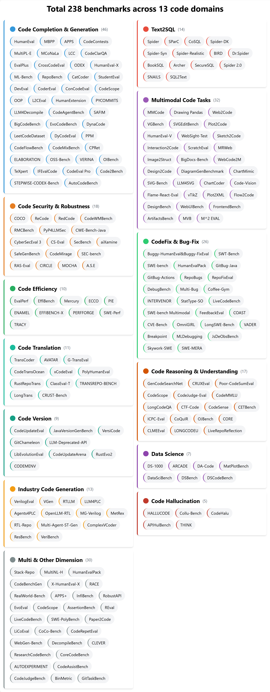

  <h1>👨‍💻 Awesome Code Benchmark</h1>
  
  

A comprehensive code domain benchmark review of LLM researches.

    

## News   
- 🔥🔥 [2025-04-13] **Featured Benchmarks**

* [SVGEditBench: A Benchmark Dataset for Quantitative Assessment of LLM's SVG Editing Capabilities](https://arxiv.org/abs/2404.13710)
* [Can Large Language Models Understand Symbolic Graphics Programs?](https://arxiv.org/html/2408.08313v1)
* [Code-Vision: Evaluating Multimodal LLMs Logic Understanding and Code Generation Capabilities](https://arxiv.org/abs/2502.11829)
* [Unraveling the Potential of Large Language Models in Code Translation: How Far Are We?](https://arxiv.org/abs/2410.09812)
* [Enhancing LLMs in Long Code Translation through Instrumentation and Program State Alignment](https://arxiv.org/abs/2504.02017)
* [PyHDL-Eval: An LLM Evaluation Framework for Hardware Design Using Python-Embedded DSLs](https://dl.acm.org/doi/10.1145/3670474.3685948)

-  [2025-04-06] We add **Code Hallucinations** benchmarks.  
-  [2025-03-29] We have crawled all the articles related to code benchmarks in the **past five years**.  
-  [2025-03-17] We add **Code Version** (Version-specific code generation) benchmarks.  
-  [2025-03-16] A thorough review of code domain benchmarks for LLM research has been released.  

## 🚀 Top Code Benchmark

### Code Completion & Code Generation

| Benchmark | Paper | Date | Github | Dataset & Website & LeaderBoard |
|:--|:--|:--|:--|:--|
| HumanEval                     | [Evaluating Large Language Models Trained on Code](https://arxiv.org/abs/2107.03374)                                                                       | Arxiv 2021/07       | [Github](https://github.com/openai/human-eval)                                | [🤗Dataset](https://huggingface.co/datasets/openai/openai_humaneval) |
| MBPP                          | [Program Synthesis with Large Language Models](https://arxiv.org/abs/2108.07732)                                                                           | Arxiv 2021/08       | | [🤗Dataset](https://huggingface.co/datasets/google-research-datasets/mbpp) |
| APPS                          | [Measuring Coding Challenge Competence With APPS](https://arxiv.org/abs/2105.09938)                                                                        | NeurIPS 2021        | [Github](https://github.com/hendrycks/apps)                                   | [🤗Dataset](https://huggingface.co/datasets/codeparrot/apps) |
| CodeContests                  | [Competition-Level Code Generation with AlphaCode](https://arxiv.org/abs/2203.07814) | Science 2022 | [Github](https://github.com/google-deepmind/code_contests) | |
| MultiPL-E                     | [MultiPL-E: A Scalable and Polyglot Approach to Benchmarking Neural Code Generation](https://ieeexplore.ieee.org/abstract/document/10103177)               | TSE 2023            | [Github](https://github.com/nuprl/MultiPL-E)                                 | [🤗Dataset](https://huggingface.co/datasets/nuprl/MultiPL-E) |
| MCoNaLa                       | [MCoNaLa: A Benchmark for Code Generation from Multiple Natural Languages](https://arxiv.org/abs/2203.08388)        | EACL 2023 Findings      | [Github](https://github.com/zorazrw/multilingual-conala) | [🤗Dataset](https://huggingface.co/datasets/neulab/mconala) |
| LCC                           | [LongCoder: A Long-Range Pre-trained Language Model for Code Completion](https://arxiv.org/abs/2306.14893)          | ICML 2023  | [Github](https://github.com/microsoft/CodeBERT/tree/master/LongCoder)    | |
| ReCode                        | [ReCode: Robustness Evaluation of Code Generation Models](https://arxiv.org/abs/2212.10264)                         | ACL 2023  | [Github](https://github.com/amazon-science/recode)    | |
| CodeClarQA                    | [Python Code Generation by Asking Clarification Questions](https://arxiv.org/abs/2212.09885v2)                                                             | ACL 2023            | [Github](https://github.com/UKPLab/codeclarqa)                                | [Dataset](https://drive.google.com/file/d/1bM-b-L10vNpk7Onyft9BXK8GlMIGl52q/view?usp=sharing) |
| EvalPlus                      | [Is Your Code Generated by Chat{GPT} Really Correct? Rigorous Evaluation of Large Language Models for Code Generation](https://arxiv.org/abs/2305.01210)   | NeurIPS 2023        | [Github](https://github.com/evalplus/evalplus)                           | [🤗Dataset](https://huggingface.co/evalplus) |
| CrossCodeEval                 | [CrossCodeEval: A Diverse and Multilingual Benchmark for Cross-File Code Completion](https://arxiv.org/abs/2310.11248)      | NeurIPS 2023  | [Github](https://github.com/amazon-science/cceval)    | |
| PLPilot                       | [PLPilot: Benchmark an Automated Programming Language Design Framework Enabled by LLMs](https://mlforsystems.org/assets/papers/neurips2023/paper13.pdf) | NeurIPS 2023  | [Github](https://github.com/changkaiyan/plpilot)   | |
| Buggy-HumanEval&Buggy-FixEval | [Large Language Models of Code Fail at Completing Code with Potential Bugs](https://arxiv.org/abs/2306.03438) | NeurIPS 2023  | [Github](https://github.com/amazon-science/buggy-code-completion) | |
| ODEX                          | [Execution-Based Evaluation for Open-Domain Code Generation](https://arxiv.org/abs/2212.10481)      | EMNLP 2023 Findings  | [Github](https://github.com/zorazrw/odex)    | |
| GenCodeSearchNet              | [GenCodeSearchNet: A Benchmark Test Suite for Evaluating Generalization in Programming Language Understanding](https://arxiv.org/abs/2311.09707) | GenBench Workshop 2023 | [Github](https://github.com/drndr/gencodesearchnet) | [🤗Dataset](https://huggingface.co/datasets/drndr/statcodesearch) |
| HumanEval-X                   | [CodeGeeX: A Pre-Trained Model for Code Generation with Multilingual Benchmarking on HumanEval-X](https://arxiv.org/abs/2303.17568) | SIGKDD 2023 | [Github](https://github.com/THUDM/CodeGeeX) | |
| Stack-Repo                    | [RepoFusion: Training Code Models to Understand Your Repository](https://arxiv.org/abs/2306.10998)                  | Arxiv 2023/06       | [Github](https://github.com/seketeam/DevEval) | [🤗Dataset](https://huggingface.co/RepoFusion) |
| COCO                          | [COCO: Testing Code Generation Systems via Concretized Instructions](https://arxiv.org/abs/2308.13319)      | Arxiv 2023/08  | [Github](https://github.com/coco-2023/COCO)    | |
| ML-Bench                      | [ML-Bench: Evaluating Large Language Models and Agents for Machine Learning Tasks on Repository-Level Code](https://arxiv.org/abs/2311.09835) | Arxiv 2023/11  | [Github](https://github.com/gersteinlab/ML-bench)   | [🤗Dataset](https://huggingface.co/datasets/super-dainiu/ml-bench)|
| RepoBench                     | [RepoBench: Benchmarking Repository-Level Code Auto-Completion Systems](https://arxiv.org/abs/2306.03091)           | ICLR 2024  | | |
| StudentEval                   | [StudentEval: A Benchmark of Student-Written Prompts for Large Language Models of Code](https://arxiv.org/abs/2306.10998)            | ACL 2024 Findings       | [Github](https://github.com/Wellesley-EASEL-lab/StudentEval) | [🤗Dataset](https://huggingface.co/datasets/wellesley-easel/StudentEval) |
| DevEval                       | [DevEval: A Manually-Annotated Code Generation Benchmark Aligned with Real-World Code Repositories](https://arxiv.org/abs/2405.19856)                      | ACL 2024            | [Github](https://github.com/seketeam/DevEval)                                | [🤗Dataset](https://huggingface.co/datasets/LJ0815/DevEval/blob/main/Source_Code.tar.gz)|
| LongBench                     | [LongBench: A Bilingual, Multitask Benchmark for Long Context Understanding](https://arxiv.org/abs/2308.14508)      | ACL 2024  | [Github](https://github.com/THUDM/LongBench)    | [🤗Dataset](https://huggingface.co/datasets/THUDM/LongBench)|
| CommitPack & HumanEvalPack    | [OctoPack: Instruction Tuning Code Large Language Models](https://arxiv.org/abs/2308.07124)      | ICLR 2024  | [Github](https://github.com/bigcode-project/octopack)    | |
| BioCoder                      | [BioCoder: A Benchmark for Bioinformatics Code Generation with Large Language Models](https://arxiv.org/abs/2308.16458)      | Bioinformatics, July 2024  | [Github](https://github.com/gersteinlab/biocoder)    | [🤗Dataset](https://huggingface.co/datasets/lilbillbiscuit/biocoder_public) |
| MT-Bench-101                  | [MT-Bench: How Good are LLMs at Multi-turn Question Answering](https://arxiv.org/abs/2402.14762) | ACL 2024 | [Github](https://github.com/mtbench101/mt-bench-101)     | |
| CoderEval                     | [CoderEval: A Benchmark of Pragmatic Code Generation with Generative Pre-trained Models](https://arxiv.org/abs/2302.00288) | ICSE 2024  | [Github](https://github.com/CoderEval/CoderEval) | |
| APPS+                         | [StepCoder: Improve Code Generation with Reinforcement Learning from Compiler Feedback](https://arxiv.org/abs/2402.01391) | ACL 2024 | [Github](https://github.com/Ablustrund/APPS_Plus) | |
| OOP                           | [OOP: Object-Oriented Programming Evaluation Benchmark for Large Language Models](https://arxiv.org/abs/2401.06628) | ACL 2024 Findings | [Github](https://github.com/alphadl/OOP-eval)   | [🤗Dataset](https://huggingface.co/datasets/codeai-dteam/oop)         |
| L2CEval                       | [L2CEval: Evaluating Language-to-Code Generation Capabilities of Large Language Models](https://arxiv.org/abs/2309.17446) | TACL 2024 | | |
| ICE-Score                     | [ICE-Score: Instructing Large Language Models to Evaluate Code](https://arxiv.org/abs/2304.14317) | EACL 2024 Findings | [Github](https://github.com/terryyz/ice-score) | |
| HumanExtension                | [Exploring Language Model's Code Generation Ability with Auxiliary Functions](https://arxiv.org/abs/2403.10575) | NAACL 2024 Findings | [Github](https://github.com/sh0416/humanextension) | |
| R2E-Eval1                     | [R2E: Turning Any GitHub Repository into a Programming Agent Test Environment](https://dl.acm.org/doi/10.5555/3692070.3692922) | ICML 2024 | [Github](https://github.com/r2e-project/r2e) | |
| InfiBench                     | [InfiBench: Evaluating the Question-Answering Capabilities of Code Large Language Models](https://arxiv.org/abs/2404.07940) | NeurIPS 2024 | [Github](https://github.com/infi-coder/infibench-evaluation-harness/) | [🌐Website](https://infi-coder.github.io/infibench/) |
| CodeBenchGen                  | [CodeBenchGen: Creating Scalable Execution-based Code Generation Benchmarks](https://arxiv.org/abs/2404.00566) | Arxiv 2024/04  | [Github](https://github.com/yiqingxyq/CodeBenchGen) | |
| LeetCodeEval                  | [A Performance Study of LLM-Generated Code on Leetcode](https://arxiv.org/abs/2407.21579) | EASE 2024 | | |
| RobustAPI                     | [Can LLM Replace Stack Overflow? A Study on Robustness and Reliability of Large Language Model Code Generation](https://arxiv.org/abs/2308.10335) | AAAI 2024 | [Github](https://github.com/FloridSleeves/RobustAPI) | [🤗Dataset](https://huggingface.co/datasets/LilyZZZ/RobustAPI) |
| PYCOMMITS                     | [Coeditor: Leveraging Contextual Changes for Multi-round Code Auto-editing](https://arxiv.org/abs/2305.18584) | ICLR 2024 | [Github](https://github.com/MrVPlusOne/Coeditor) | |
| EvoEval                       | [Top Leaderboard Ranking = Top Coding Proficiency, Always? EvoEval: Evolving Coding Benchmarks via LLM](https://arxiv.org/abs/2403.19114) | COLM 2024 | [Github](https://github.com/evo-eval/evoeval) | |
| LLM4Decompile                 | [LLM4Decompile: Decompiling Binary Code with Large Language Models](https://arxiv.org/abs/2403.05286) | EMNLP 2024 | [Github](https://github.com/albertan017/LLM4Decompile) | |
| CodeAgentBench                | [CodeAgent: Enhancing Code Generation with Tool-Integrated Agent Systems for Real-World Repo-level Coding Challenges](https://arxiv.org/abs/2401.07339) | ACL 2024 | | |
| SAFIM                         | [Evaluation of LLMs on Syntax-Aware Code Fill-in-the-Middle Tasks](https://arxiv.org/abs/2403.04814) | ICLR 2024 | [Github](https://github.com/gonglinyuan/safim)   | [🤗Dataset](https://huggingface.co/datasets/gonglinyuan/safim) |
| MultiNL-H                     | [Improving Natural Language Capability of Code Large Language Model](https://arxiv.org/abs/2401.14242) | Arxiv 2024/01  | [Github](https://github.com/NL2Code/AttentionCoder) | |
| X-HumanEval-X                 | [Exploring Multi-Lingual Bias of Large Code Models in Code Generation](https://arxiv.org/abs/2404.19368) | Arxiv 2024/04  | | |
| CatCoder                      | [Enhancing Repository-Level Code Generation with Integrated Contextual Information](https://arxiv.org/abs/2406.03283) | Arxiv 2024/06  | | |
| AICoderEval                   | [AICoderEval: Improving AI Domain Code Generation of Large Language Models](https://arxiv.org/abs/2406.04712) | Arxiv 2024/06  | | [🤗Dataset](https://huggingface.co/datasets/vixuowis/AICoderEval) |
| ConCodeEval                   | [ConCodeEval: Evaluating Large Language Models for Code Constraints in Domain-Specific Languages](https://arxiv.org/abs/2407.03387) | Arxiv 2024/07  | | |
| RealWorld-Bench               | [What's Wrong with Your Code Generated by Large Language Models? An Extensive Study](https://arxiv.org/abs/2407.06153)                             | Arxiv 2024/07               | | |
| AssertionBench                | [AssertionBench: A Benchmark to Evaluate Large-Language Models for Assertion Generation](https://arxiv.org/abs/2406.18627) | NAACL 2025 | [Github](https://github.com/achieve-lab/assertion_data_for_LLM) | |
| REval                         | [Evaluating Large Language Models with Runtime Behavior of Program Execution](https://arxiv.org/abs/2403.16437) | ICSE 2025 | [Github](https://github.com/r-eval/r-eval.github.io) | [📊LeaderBoard](https://r-eval.github.io/) |
| BigCodeBench                  | [BigCodeBench: Benchmarking Code Generation with Diverse Function Calls and Complex Instructions](https://arxiv.org/abs/2406.15877) | ICLR 2025 | [Github](https://github.com/bigcode-project/bigcodebench) | [📊LeaderBoard](https://huggingface.co/spaces/bigcode/bigcodebench-leaderboard) |
| EvoCodeBench                  | [EvoCodeBench: An Evolving Code Generation Benchmark Aligned with Real-World Code Repositories](https://arxiv.org/abs/2404.00599) | NeurIPS 2025 | [Github](https://github.com/seketeam/EvoCodeBench) | [🤗Dataset](https://huggingface.co/datasets/LJ0815/EvoCodeBench) |
| DynaCode                      | [DynaCode: A Dynamic Complexity-Aware Code Benchmark for Evaluating Large Language Models in Code Generation](https://arxiv.org/abs/2503.10452)            | Arxiv 2025/03       | | |
| Prism                         | [Prism Dynamic and Flexible Benchmarking of LLMs Code Generation with Monte Carlo Tree Search]()    ||||

Details of Code Completion & Code Generation Benchmarks <i>:: click to expand ::</i>

* **HumanEval**: code completion 
* **MBPP**: text -> code; code generation 
* **APPS**: a benchmark for code generation from natural language specifications
* **EvalPlus**: extends the HumanEval and MBPP benchmarks
* **MultiPL-E**: extends the HumanEval and MBPP benchmarks to 18 languages
* **CodeClarQA**: containing pairs of natural language descriptions and code with created synthetic clarification questions and answers.
* **DevEval**: repo-level code generation
* **BigCodeBench**: complete Split & Instruct Split
* **DynaCode**: a dynamic complexity-aware code benchmark
* **Stack-Repo**: repo-level code completion of java
* **StudentEval**: a benchmark of student-written prompts for code generation evaluation
* **MCoNaLa**: code generation from multiple natural languages
* **LCC**: long code context code completion
* **RepoBench**: repo-level code auto-completion
* **ReCode**: a comprehensive robustness evaluation benchmark for code generation
* **LongBench**: a bilingual, multitask benchmark for long context understanding
* **CommitPack & HumanEvalPack**: multilingual code editing and understanding benchmarks based on Git commits and HumanEval extensions
* **COCO**: instruction-level robustness benchmark for code generation
* **ODEX**: open-domain, execution-based natural language to code generation
* **BioCoder**:  bioinformatics code generation
* **CrossCodeEval**: diverse and multilingual benchmark for cross-file code completion
* **Buggy-HumanEval & Buggy-FixEval**: buggy code completion
* **MT-Bench-101**: Multi-turn question answering
* **ML-Bench**: repo-level ML task solving benchmark using real-world code
* **PLPilot**: Benchmark automating programming language design tasks
* **CoderEval**: pragmatic code generation
* **MultiNL-H**: multilingual NL-to-code benchmark with keyword-guided generation
* **APPS+**: enhanced version of the APPS dataset, designed for reinforcement learning in code generation
* **OOP**: object-oriented programming evaluation benchmark of python programs
* **-**: static analysis-based evaluation framework for LLM code completions using ASTs
* **L2CEval**: multilingual, multi-task NL-to-code benchmark including semantic parsing, math reasoning and Python programming.
* **ICE-Score**: an evaluation metric for code quality without test cases or references
* **HumanExtension**：auxiliary-function-based code generation benchmark
* **R2E-Eval1**：repo-level programming agent benchmark from GitHub repos for evaluating static and interactive code generation systems
* **REval**: evaluates code LLMs’ reasoning and consistency with runtime behavior
* **InfiBench**: free-form question-answering benchmark comprising 234 high-quality Stack Overflow questions across 15 programming languages
* **RobustAPI**: Java API misuse benchmark from Stack Overflow for evaluating LLM code robustness
* **EvoCodeBench**: evolving Python code generation benchmark from real GitHub commits
* **CodeBenchGen**: scalable Python code generation benchmark built from GitHub functions and docstrings with execution-based evaluation
* **LeetCodeEval**: Leetcode-based benchmark for comparing LLM vs. human code performance
* **X-HumanEval-X**: exploring Multi-Lingual Bias of Large Code Models in Code Generation
* **PYCOMMITS**: multi-round Python code editing benchmark from real commit histories
* **CodeContests**: complex programming task
* **EvoEval**: a comprehensive evaluation of LLMs' coding abilities across diverse domains
* **LLM4Decompile**: benchmark for evaluating binary-to-C decompilation on real-world open-source binaries
* **CatCoder**: a framework for repo-level code generation in statically typed languages using code and type context
* **AICoderEval**: AI task-specific code generation benchmark for LLMs in NLP, CV, and multimodal learning
* **CodeAgentBench**: repo-level code generation benchmark with tool-integrated agents for real-world tasks
* **AssertionBench**: assertion generation for hardware design verification
* **SAFIM**: syntax-aware code completion benchmark focusing on code blocks and conditional expressions​
* **GenCodeSearchNet**: benchmark for evaluating LLM generalization in programming language understanding across tasks and languages
* **ConCodeEval**: benchmark for assessing LLMs' understanding of code constraints in domain-specific languages like JSON and YAML

---

* HumanEval-XL: A Multilingual Code Generation Benchmark for Cross-lingual Natural Language Generalization
* CodeScope: An Execution-based Multilingual Multitask Multidimensional Benchmark for Evaluating LLMs on Code Understanding and Generation
* XCodeEval: An Execution-based Large Scale Multilingual Multitask Benchmark for Code Understanding, Generation, Translation and Retrieval
* Fine-tuning Language Models for Joint Rewriting and Completion of Code with Potential Bugs | ACL 2024 Findings |
* PythonSaga: Redefining the Benchmark to Evaluate Code Generating LLMs https://aclanthology.org/2024.findings-emnlp.996.pdf
* ComplexCodeEval: A Benchmark for Evaluating Large Code Models on More Complex Code (It covers multiple aspects, including tasks such as code generation, code completion, API recommendation, and test case generation, and aims to comprehensively evaluate the performance of large language models in complex code scenarios.)
* JavaBench: A Benchmark of Object-Oriented Code Generation for Evaluating Large Language Models
* HumanEvalComm: Benchmarking the Communication Competence of Code Generation for LLMs and LLM Agent https://arxiv.org/abs/2406.00215
* CoderUJB: An Executable and Unified Java Benchmark for Practical Programming Scenarios https://arxiv.org/abs/2403.19287
* CodeScore: Evaluating Code Generation by Learning Code Execution (MBPP-ET)
* CrossCodeBench: Benchmarking Cross-Task Generalization of Source Code Models
* Teaching Code LLMs to Use Autocompletion Tools in Repository-Level Code Generation

### Code Efficiency
| Benchmark | Paper | Date | Github | Dataset & Website & LeaderBoard |
|:--|:--|:--|:--|:--|
| EvalPerf      | [Evaluating Language Models for Efficient Code Generation](https://arxiv.org/abs/2408.06450)                                          | COLM 2024                   | [Github](https://github.com/evalplus/evalplus)        | [🤗Dataset](https://huggingface.co/datasets/evalplus/evalperf) |
| EffiBench     | [EffiBench: Benchmarking the Efficiency of Automatically Generated Code](https://arxiv.org/abs/2402.02037)                            | NeurIPS 2024                | [Github](https://github.com/huangd1999/EffiBench)     |  |
| Mercury       | [Mercury: A Code Efficiency Benchmark for Code Large Language Models](https://arxiv.org/abs/2402.07844v4)                             | NeurIPS 2024                | [Github](https://github.com/Elfsong/Mercury)          | [🤗Dataset](https://huggingface.co/datasets/Elfsong/Mercury) |
| ECCO          | [ECCO: Can We Improve Model-Generated Code Efficiency Without Sacrificing Functional Correctness?](https://arxiv.org/abs/2407.14044)  | EMNLP 2024                  | [Github](https://github.com/CodeEff/ECCO)             | [🤗Dataset](https://huggingface.co/datasets/CodeEff/ECCO)|
| PIE           | [Learning Performance-Improving Code Edits](https://arxiv.org/abs/2302.07867)                                                         | ICLR 2024                   | [Github](https://github.com/LearningOpt/pie)          | [🌐🌐Website](https://pie4perf.com)|  
| ENAMEL        | [How Efficient is LLM-Generated Code? A Rigorous & High-Standard Benchmark](https://arxiv.org/abs/2406.06647)                         | ICLR 2025                   | [Github](https://github.com/q-rz/enamel)              | [🤗Dataset](https://huggingface.co/datasets/q-rz/enamel) |

### CodeFix & Bug-Fix
| Benchmark | Paper | Date | Github | Dataset & Website & LeaderBoard |
|:--|:--|:--|:--|:--|
| HumanEvalFix          | [OctoPack: Instruction Tuning Code Large Language Models](https://arxiv.org/abs/2308.07124)                                    | Arxiv 2023/08              | [Github](https://github.com/bigcode-project/octopack)        | [🤗Dataset](https://huggingface.co/datasets/bigcode/humanevalpack) |
| Socratic-Debugging | [Socratic Questioning of Novice Debuggers: A Benchmark Dataset and Preliminary Evaluations](https://aclanthology.org/2023.bea-1.57.pdf) | BEA 2023 | [Github](https://github.com/taisazero/socratic-debugging-benchmark) |  |
| TFix & ManySStuBs4J & TSSB-3M | [Towards Low-Resource Automatic Program Repair with Meta-Learning and Pretrained Language Models](https://aclanthology.org/2023.emnlp-main.430.pdf) | EMNLP 2023 | [Github](https://github.com/wang-weishi/Meta-APR) |  |
| SWT-Bench             | [SWT-Bench: Testing and Validating Real-World Bug-Fixes with Code Agents](https://arxiv.org/abs/2406.12952)                    | NeurIPS 2024               | [Github](https://github.com/logic-star-ai/SWT-Bench)         | [🌐Website](https://swtbench.com) |
| SWE-bench             | [SWE-bench: Can Language Models Resolve Real-World GitHub Issues?](https://arxiv.org/abs/2310.06770)                           | ICLR 2024                  | [Github](https://github.com/swe-bench/SWE-bench)             | [🌐Website](https://www.swebench.com) |
| GitBug-Java     | [GitBug-Java: A Reproducible Benchmark of Recent Java Bugs](https://arxiv.org/abs/2402.02961v2)                                      | MSR 2024                   | [Github](https://github.com/gitbugactions/gitbug-java) | [🌐Website](https://nuno.saavedra.pt/gitbug-java#!/) [🤗Dataset](https://huggingface.co/datasets/gitbugactions/gitbug-java) |
| GitBug-Actions | [GitBug-Actions: Building Reproducible Bug-Fix Benchmarks with GitHub Actions](https://arxiv.org/abs/2310.15642)                             | ICSE 2024 Demo              | [Github](https://github.com/gitbugactions/gitbugactions) | [▶️Video](https://www.youtube.com/watch?v=aBWwa1sJYBs) |
| RepoBugs       | [When Large Language Models Confront Repository-Level Automatic Program Repair: How Well They Done?](https://arxiv.org/abs/2403.00448)    | ICSE 2024 Track | | |
| RepoFixEval    | [RepoFixEval: A Repository-Level Program Repair Benchmark From Issue Discovering to Bug Fixing](https://openreview.net/pdf?id=LaNCeNmoHR) | Openreview 2024 | | |
| DebugBench     | [DebugBench: Evaluating Debugging Capability of Large Language Models](https://arxiv.org/abs/2401.04621)                                     | ACL 2024            | [Github](https://github.com/thunlp/DebugBench) | [🤗Dataset](https://huggingface.co/datasets/Rtian/DebugBench) |
| Multi-Bug      | [Instruct, Not Assist: LLM-based Multi-Turn Planning and Hierarchical Questioning for Socratic Code Debugging](https://arxiv.org/abs/2406.11709)        | EMNLP 2024 Findings | [Github](https://github.com/agarwalishika/TreeInstruct) | |
| Coffee-Gym     | [Coffee-Gym: An Environment for Evaluating and Improving Natural Language Feedback on Erroneous Code](https://arxiv.org/abs/2409.19715) | EMNLP 2024 |  | [🤗Dataset](https://huggingface.co/spaces/Coffee-Gym/Project-Coffee-Gym) |
| INTERVENOR     | [INTERVENOR: Prompt the Coding Ability of Large Language Models with the Interactive Chain of Repairing](https://arxiv.org/abs/2311.09868) | ACL 2024 Findings | [Github](https://github.com/NEUIR/INTERVENOR) ||
| StatType-SO    | [ZS4C: Zero-Shot Synthesis of Compilable Code for Incomplete Code Snippets using LLMs](https://arxiv.org/abs/2401.14279)                       | TOSEM 2024         | [Github]() | |
| LiveCodeBench | [LiveCodeBench: Holistic and Contamination Free Evaluation of Large Language Models for Code](https://arxiv.org/abs/2403.07974) | ICLR 2025 | [Github](https://github.com/LiveCodeBench/LiveCodeBench) | [🌐Website](https://livecodebench.github.io/) [🤗Dataset](https://huggingface.co/livecodebench) [📊LeaderBoard](https://livecodebench.github.io/leaderboard.html) |
| SWE-bench Multimodal | [SWE-bench Multimodal: Do AI Systems Generalize to Visual Software Domains?](https://arxiv.org/abs/2410.03859) | ICLR 2025 | [Github](https://github.com/swe-bench/SWE-bench) | [🌐Website](https://www.swebench.com/multimodal) [🤗Dataset](https://www.swebench.com/multimodal) |
| FeedbackEval  | FeedbackEval A Benchmark for Evaluating Large Language Models in Feedback-Driven Code Repair Tasks || ||

Details of Details of CodeFix & Bug-Fix <i>:: click to expand ::</i>

* **HumanEvalFix**: code repair capabilitie 
* **SWT-Bench**: Evaluating LLMs on testing generation for real world software issues 
* **SWE-bench**: Evaluating LLMs Resolve Real-World GitHub Issues 
* **SWE-bench Multimodal**: Evaluate LLMs on their ability to fix bugs in visual, user-facing JavaScript software 
* **GitBug-Java**: automatic program repair and fault localization of Java bugs
* **GitBug-Actions**: constructing reproducible bug-fix benchmarks using GitHub Actions
* **LiveCodeBench**: dynamic benchmark for contamination-free evaluation of LLMs from real-world platforms
* **RepoBugs**: repo-level bug-fix benchmark for evaluating LLM-based program repair with full context
* **RepoFixEval**: repository-level program repair benchmark for evaluating LLMs on issue discovery, fault localization, and code fixing
* **DebugBench**: evaluating LLMs' debugging capabilities across various bug categories and types
* **Multi-Bug**: a dataset for evaluating LLMs on multi-bug code debugging tasks
* **Socratic-Debugging**: evaluating LLMs on interactive, dialogue-based bug fixing
* **Coffee-Gym**: interactive benchmark environment for evaluating LLMs on NL-guided code repair
* **INTERVENOR**: interactive code repair benchmark with multi-turn learner–teacher dialogue
* **TFix & ManySStuBs4J & TSSB-3M**: evaluating automatic program repair in JavaScript, Java, and Python
* **StatType-SO**: benchmark for resolving imports and types in incomplete Stack Overflow code snippets

### Code Reasoning & Understanding

|Benchmark | Paper | Date | Github | Dataset & Website & LeaderBoard |
|:--|:--|:--|:--|:--|
| CRUXEval      | [CRUXEval: A Benchmark for Code Reasoning, Understanding and Execution](https://arxiv.org/abs/2401.03065)                                      | Arxiv 2024/01         | [Github](https://github.com/facebookresearch/cruxeval)        | [📊LeaderBoard](https://crux-eval.github.io/leaderboard.html) |
| Poor-CodeSumEval | [How Effectively Do Code Language Models Understand Poor-Readability Code?](https://dl.acm.org/doi/10.1145/3691620.3695072) | ASE 2024 | [Github](https://github.com/ythere-y/PoorCodeSumEval) | [🤗Dataset](https://huggingface.co/datasets/google/code_x_glue_ct_code_to_text) |
|  | [A Novel Refactoring and Semantic Aware Abstract Syntax Tree Differencing Tool and a Benchmark for Evaluating the Accuracy of Diff Tools](https://arxiv.org/abs/2403.05939) | TOSEM 2024 | [Github](https://github.com/pouryafard75/DiffBenchmark?utm_source=chatgpt.com) |  |
| CodeMMLU      | [CodeMMLU: A Multi-Task Benchmark for Assessing Code Understanding Capabilities of CodeLLMs](https://arxiv.org/abs/2410.01999)                 | ICLR 2025             | [Github](https://github.com/FSoft-AI4Code/CodeMMLU/)          | [🤗Dataset](https://huggingface.co/datasets/Fsoft-AIC/CodeMMLU) [📊LeaderBoard](https://fsoft-ai4code.github.io/leaderboards/codemmlu/) [🌐  Website](https://fsoft-ai4code.github.io/codemmlu/) |
|CodeJudge-Eval| [CodeJudge-Eval: Can Large Language Models be Good Judges in Code Understanding?](https://arxiv.org/abs/2408.10718) | COLING 2025                        | [Github](https://github.com/CodeLLM-Research/CodeJudge-Eval) |  |

Details of Details of Code Reasoning & Understanding <i>:: click to expand ::</i>

* **CRUXEval**: code reasoning, understanding, and execution capabilities
* **CodeMMLU**: code understanding and comprehension
* **CodeQueries**: A Dataset of Semantic Queries over Code
* A Benchmark for Testing the Capabilities of LLMs in Assessing the Quality of Multiple-choice Questions in Introductory Programming Education

### Code Hallucinations
| Benchmark | Paper | Date | Github | Dataset & Website & LeaderBoard |
|:--|:--|:--|:--|:--|
| VisDiaHalBench | [VisDiaHalBench: A Visual Dialogue Benchmark For Diagnosing Hallucination in Large Vision-Language Models](https://aclanthology.org/2024.acl-long.658.pdf) | ACL 2024 | [Github](https://github.com/qingxingcao/VisDiaHalBench) | |
| HallusionBench | [HallusionBench: An Advanced Diagnostic Suite for Entangled Language Hallucination and Visual Illusion in Large Vision-Language Models](https://arxiv.org/abs/2310.14566) | CVPR 2024 | [Github](https://github.com/tianyi-lab/HallusionBench) | [📊LeaderBoard](https://paperswithcode.com/sota/visual-question-answering-vqa-on-3) |
| UHGEval | [UHGEval: Benchmarking the Hallucination of Chinese Large Language Models via Unconstrained Generation](https://arxiv.org/abs/2311.15296) | ACL 2024 | [Github](https://github.com/IAAR-Shanghai/UHGEval) | [🤗Dataset](https://huggingface.co/datasets/Ki-Seki/UHGEvalDataset) |
| HALLUCODE | [Exploring and Evaluating Hallucinations in LLM-Powered Code Generation](https://arxiv.org/abs/2404.00971) | Arxiv 2024/04  | ||
| CodeHalu | [CodeHalu: Investigating Code Hallucinations in LLMs via Execution-based Verification (Hallucination benchmark)](https://arxiv.org/abs/2405.00253) | AAAI 2025 | [Github](https://github.com/yuchen814/CodeHalu) |  |

Details of Details of Code Hallucinations <i>:: click to expand ::</i>

* **VisDiaHalBench**: evaluate hallucinations in LVLMs under multi-turn visual dialogues with misleading textual history and edited images
* **HallusionBench**: evaluate LVLMs' visual reasoning abilities and hallucination tendencies through control-structured questions grounded in expert-annotated image contexts
* **UHGEval**: evaluate hallucinations in unconstrained text generation by LLMs, focusing on real-world applicability and Chinese-language model performance
* **HALLUCODE**: evaluate LLMs' ability to recognize and mitigate hallucinations in code generation
* **CodeHalu**: systematically evaluate code hallucinations in LLMs through execution-based verification

### Data science
| Benchmark | Paper | Date | Github | Dataset & Website & LeaderBoard |
|:--|:--|:--|:--|:--|
| DS-1000      | [DS-1000: A Natural and Reliable Benchmark for Data Science Code Generation](https://arxiv.org/abs/2211.11501)                                      | ICML 2023                 | [Github](https://github.com/xlang-ai/DS-1000)        | [🌐HomePage](https://ds1000-code-gen.github.io) [🤗Dataset](https://huggingface.co/datasets/xlangai/DS-1000)  |
| ARCADE | [Natural Language to Code Generation in Interactive Data Science Notebooks](https://arxiv.org/abs/2212.09248) | ACL 2023 | [Github](https://github.com/google-research/arcade-nl2code?utm_source=chatgpt.com) | [Dataset](https://www.kaggle.com/datasets/googleai/arcade-nl2code-dataset) |
| DA-Code      | [DA-Code: Agent Data Science Code Generation Benchmark for Large Language Models](https://arxiv.org/abs/2410.07331)                                 | EMNLP 2024                | [Github](https://github.com/yiyihum/da-code)         | [🌐Website](https://da-code-bench.github.io) [🤗Dataset](https://huggingface.co/datasets/Jianwen2003/DA-Code) |
| GeoCodeBench | [Evaluation of Code LLMs on Geospatial Code Generation](https://arxiv.org/abs/2410.04617)                                                                        | GeoAI 2024                | [Github](https://github.com/kraina-ai/geospatial-code-llms-dataset) | |
| MatPlotBench | [MatPlotAgent: Method and Evaluation for LLM-Based Agentic Scientific Data Visualization](https://arxiv.org/abs/2402.11453) | ACL 2024 Findings | [Github](https://github.com/thunlp/MatPlotAgent) | |
| SensorBench  | [SensorBench: Benchmarking LLMs in Coding-Based Sensor Processing](https://arxiv.org/abs/2410.10741) | HotMobile 2025 | [Github](https://github.com/nesl/LLM_sensor_processing) | |

 Details of Data science <i>:: click to expand ::</i>

* **DS-1000**: Data Science Code Generation
* **DA-Code**: Data science tasks
* **GeoCodeBench** (inferred name): evaluation benchmark for testing LLMs on geospatial code generation tasks
* **SensorBench**: benchmark for evaluating LLMs on real-world sensor data processing tasks
* **MatPlotBench**: evaluating LLMs on scientific data visualization through code generation and visual feedback
* **ARCADE**: benchmark of multi-turn NL-to-code generation tasks in data science notebooks
* Natural Language to Code Generation in Interactive Data Science Notebooks

### Text2SQL 
| Benchmark | Paper | Date | Github | Dataset & Website & LeaderBoard |
|:--|:--|:--|:--|:--|
| Spider      | [Spider: A Large-Scale Human-Labeled Dataset for Complex and Cross-Domain Semantic Parsing and Text-to-SQL Task](https://arxiv.org/abs/1809.08887)      | EMNLP 2018     | [Github](https://github.com/taoyds/spider)        | [🌐Homepage](https://yale-lily.github.io/spider) |
| SParC | [SParC: Cross-Domain Semantic Parsing in Context](https://arxiv.org/abs/1906.02285) | ACL 2019 | [Github](https://github.com/taoyds/sparc) | [🌐Website](https://yale-lily.github.io/sparc) |
| CoSQL | [CoSQL: A Conversational Text-to-SQL Challenge Towards Cross-Domain Natural Language Interfaces to Databases](https://aclanthology.org/D19-1204.pdf) | EMNLP-IJCNLP 2019 | [Github](https://yale-lily.github.io/cosql) | [🌐Website](https://yale-lily.github.io/cosql) |
| Spider-DK          | [Exploring underexplored limitations of crossdomain text-to-sql generalization](https://arxiv.org/abs/2109.05157) | EMNLP 2021          | [Github](https://github.com/ygan/Spider-DK)                  |                                                 |
| Spider-Syn  | [Towards robustness of text-to-SQL models against synonym substitution](https://arxiv.org/abs/2106.01065)                                                   | ACL 2021 | [Github](https://github.com/ygan/Spider-Syn) | |
| Spider-Realistic | [Structure-Grounded Pretraining for Text-to-SQL](https://arxiv.org/abs/2010.12773)                                                                      | NAACL 2021 | | [Dataset](https://zenodo.org/records/5205322) |
| BIRD        | [Can LLM Already Serve as A Database Interface? A BIg Bench for Large-Scale Database Grounded Text-to-SQLs](https://arxiv.org/abs/2305.03111)      | NeurIPS 2023    | [Github](https://github.com/AlibabaResearch/DAMO-ConvAI/tree/main/bird) | [🌐Website](https://bird-bench.github.io/) |
| Dr.Spider   | [Dr.Spider: A Diagnostic Evaluation Benchmark towards Text-to-SQL Robustness](https://arxiv.org/abs/2301.08881)                                             | ICLR 2023  | [Github](https://github.com/awslabs/diagnostic-robustness-text-to-sql) | |
| ScienceBenchmark | [ScienceBenchmark: A Complex Real-World Benchmark for Evaluating Natural Language to SQL Systems](https://arxiv.org/abs/2306.04743) | VLDB Endowment 2023 |  | |
| BookSQL     | [BookSQL: A Large Scale Text-to-SQL Dataset for Accounting Domain](https://arxiv.org/abs/2406.07860)                                                        | NAACL 2024 | [Github](https://github.com/Exploration-Lab/BookSQL) | |
| Archer      | [Archer: A Human-Labeled Text-to-SQL Dataset with Arithmetic, Commonsense and Hypothetical Reasoning](https://arxiv.org/abs/2402.12554)                    | EACL 2024 | | |
| EHRSQL-2024 | [Overview of the EHRSQL 2024 Shared Task on Reliable Text-to-SQL Modeling on Electronic Health Records](https://arxiv.org/abs/2405.06673)                | ClinicalNLP 2024 | [Github](https://github.com/glee4810/ehrsql-2024) | |
| SecureSQL          | [SecureSQL: Evaluating Data Leakage of Large Language Models as Natural Language Interfaces to Databases](https://aclanthology.org/2024.findings-emnlp.346.pdf) | EMNLP 2024 Findings | [Github](https://github.com/JacobiSong/SecureSQL)            | |
| BULL        | [FinSQL: Model-Agnostic LLMs-based Text-to-SQL Framework for Financial Analysis](https://arxiv.org/abs/2401.10506)                                          | SIGMOD/PODS 2024 | [Github]() | |
|cwd-benchmark-data| [A Benchmark to Understand the Role of Knowledge Graphs on Large Language Model's Accuracy for Question Answering on Enterprise SQL Databases](https://arxiv.org/abs/2311.07509) | GRADES-NDA 24 | [Github](https://github.com/datadotworld/cwd-benchmark-data) |  |
|Spider 2.0| [Spider 2.0: Evaluating Language Models on Real-World Enterprise Text-to-SQL Workflows](https://arxiv.org/abs/2411.07763) | ICLR 2025 | [Github](https://github.com/xlang-ai/Spider2) | [🌐Website](https://spider2-sql.github.io) |
|SNAILS| [SNAILS: Schema Naming Assessments for Improved LLM-Based SQL Inference](https://dl.acm.org/doi/10.1145/3709727) | PACMMOD 2025 |  |  |
|SQL2Text| [Semantic Captioning: Benchmark Dataset and Graph-Aware Few-Shot In-Context Learning for SQL2Text](https://arxiv.org/abs/2501.03166) | COLING 2025 | [Github](https://github.com/aliwister/ast-icl) |  |

 Details of Text2SQL <i>:: click to expand ::</i>

* **Spider**: text-to-SQL
* **SParC**: evaluate context-dependent and cross-domain text-to-SQL parsing with multi-turn question sequences
* **CoSQL**: evaluate cross-domain, SQL-grounded multi-turn dialogue systems with tasks including state tracking, response generation, and user intent prediction over unseen databases
* **Spider 2.0**: text-to-SQL
* **SNAILS**: benchmark for evaluating how schema identifier naturalness affects LLM-based NL-to-SQL performance
* **BIRD**: large-scale text-to-SQL benchmark focusing on value comprehension and SQL efficiency in realistic industrial settings
* **SecureSQL**: benchmark for evaluating sensitive data leakage risks in LLM-generated SQL
* **SQL2Text**: a dataset repurposed from Text-to-SQL resources for evaluating SQL-to-natural language generation  tasks
* **Spider-Syn**: derived from Spider for evaluating text-to-SQL model robustness to schema-related synonym substitution in NL questions
* **Spider-Realistic**: evaluating text-to-SQL models under more realistic text-table alignment conditions
* **Dr.Spider**: evaluating text-to-SQL model robustness across NL, SQL, and database variations
* **BookSQL**: large-scale text-to-SQL dataset for the accounting and finance domain
* **Archer**: bilingual text-to-SQL dataset focused on complex reasoning types across 20 domains
* **EHRSQL-2024**: text-to-SQL dataset for question answering over electronic health records focusing on reliability in clinical settings
* **Spider-DK**: evaluating text-to-SQL model robustness to rarely observed domain knowledge in NL questions
* **ScienceBenchmark**: NL-to-SQL benchmark for complex, domain-specific scientific databases
* **BULL**: practical text-to-SQL dataset for financial analysis, covering fund, stock, and macroeconomic databases
* **cwd-benchmark-data**: enterprise SQL QA benchmark in the insurance domain for evaluating LLM accuracy in real-world business scenarios

### MultiModal Code Generation

| Benchmark | Paper | Date| Github | Dataset & Website & LeaderBoard |
|:--|:--|:--|:--|:--|
| MatPlotBench | [MatPlotAgent: Method and Evaluation for LLM-Based Agentic Scientific Data Visualization](https://arxiv.org/abs/2402.11453) | ACL fingdings 2024 | [Github](https://github.com/thunlp/MatPlotAgent) | [🤗Dataset](https://github.com/thunlp/MatPlotAgent/tree/main/benchmark_data) |
| MMCode | [MMCode: Benchmarking Multimodal Large Language Models for Code Generation with Visually Rich Programming Problems](https://arxiv.org/abs/2404.09486) | EMNLP 2024         | [Github](https://github.com/likaixin2000/MMCode) | [🤗Dataset](https://huggingface.co/datasets/likaixin/MMCode) |
| Drawing Pandas | [Drawing Pandas: A Benchmark for LLMs in Generating Plotting Code](https://arxiv.org/html/2412.02764v2#:~:text=This) | arXiv 2024         | [Github](https://github.com/JetBrains-Research/PandasPlotBench) | [🤗Dataset](https://huggingface.co/datasets/JetBrains-Research/PandasPlotBench) |
| Web2Code | [Web2Code: A Large-scale Webpage-to-Code Dataset and Evaluation Framework for Multimodal LLMs](https://papers.nips.cc/paper_files/paper/2024/hash/cb66be286795d71f89367d596bf78ea7-Abstract-Datasets_and_Benchmarks_Track.html) | NeurIPS 2024       | [Github](https://github.com/MBZUAI-LLM/Web2code) | [🤗Dataset](https://huggingface.co/datasets/MBZUAI/Web2Code) [🌐Website](https://mbzuai-llm.github.io/webpage2code/) |
| CodeScope | [CodeScope: An Execution-based Multilingual Multitask Multidimensional Benchmark for Evaluating LLMs on Code Understanding and Generation](https://arxiv.org/abs/2311.08588) | ACL 2024           | [Github](https://github.com/WeixiangYAN/CodeScope) | [📊LeaderBoard](https://haitianliu22.github.io/code-scope-benchmark/) [🤗Dataset](https://huggingface.co/datasets/WeixiangYan/CodeScope) |
| VGBench | [VGBench: Evaluating Large Language Models on Vector Graphics Understanding and Generation](https://arxiv.org/abs/2407.10972) | EMNLP 2024 | [Github](https://github.com/vgbench/VGBench) | [🤗Dataset](https://huggingface.co/vgbench) |
| SVGEditBench | [SVGEditBench: A Benchmark Dataset for Quantitative Assessment of LLM's SVG Editing Capabilities](https://arxiv.org/abs/2404.13710) | CVPR2024 workshop | [Github](https://github.com/mti-lab/SVGEditBench) | [🤗Dataset](https://github.com/mti-lab/SVGEditBench) |
| Plot2Code | [Plot2Code: A Comprehensive Benchmark for Evaluating Multi-modal Large Language Models in Code Generation from Scientific Plots](https://arxiv.org/abs/2405.07990) | Arxiv 2024-5       | [Github](https://github.com/TencentARC/Plot2Code) | [🤗Dataset](https://huggingface.co/TencentARC) |
| HumanEval-V | [HumanEval-V: Benchmarking High-Level Visual Reasoning with Complex Diagrams in Coding Tasks](https://arxiv.org/abs/2410.12381) | arXiv 2024-10      | [Github](https://github.com/HumanEval-V/HumanEval-V-Benchmark) | [🌐Website](https://humaneval-v.github.io/) [📊LeaderBoard](https://humaneval-v.github.io/#leaderboard) [🤗Dataset](https://huggingface.co/datasets/HumanEval-V/HumanEval-V-Benchmark) |
| WebSight-Test | [WAFFLE: Multi-Modal Model for Automated Front-End Development](https://arxiv.org/abs/2410.18362) | Arxiv 2024-10      | [Github](https://github.com/lt-asset/Waffle) | [🤗Dataset](https://github.com/lt-asset/Waffle/tree/master/WebSight-Test) |
| Sketch2Code | [Sketch2Code: Evaluating Vision-Language Models for Interactive Web Design Prototyping](https://arxiv.org/abs/2410.16232) | Arxiv 2024-10      | [Github](https://github.com/microsoft/ailab/tree/master/Sketch2Code) | [🌐Website](https://sketch2code.github.io/) |
| Interaction2Code | [Interaction2Code: Benchmarking MLLM-based Interactive Webpage Code Generation from Interactive Prototyping](https://arxiv.org/abs/2411.03292) | Arxiv 2024-11      | [Github](https://github.com/WebPAI/Interaction2Code) | [🤗Dataset](https://github.com/WebPAI/Interaction2Code?tab=readme-ov-file#Dataset-Download) [📊LeaderBoard](https://github.com/WebPAI/Interaction2Code?tab=readme-ov-file#Leaderboard) |
| ScratchEval | [ScratchEval: Are GPT-4o Smarter than My Child? Evaluating Large Multimodal Models with Visual Programming Challenges](https://arxiv.org/abs/2411.18932) | Arxiv 2024-11      | [Github](https://github.com/HKBUNLP/ScratchEval) | [🤗Dataset](https://github.com/HKBUNLP/ScratchEval) |
| ScImage | [ScImage: How Good Are Multimodal Large Language Models at Scientific Text-to-Image Generation?](https://arxiv.org/abs/2412.02368) | Arxiv 2024-12 |  |  |
| MRWeb | [MRWeb: An Exploration of Generating Multi-Page Resource-Aware Web Code from UI Designs](https://arxiv.org/abs/2412.15310) | Arxiv  2024-12     | [Github](https://github.com/WebPAI/MRWeb) | [🤗Dataset](https://github.com/WebPAI/MRWeb/tree/main/dataset_collection) |
| BigDocs-Bench | [BigDocs: An Open Dataset for Training Multimodal Models on Document and Code Tasks](https://arxiv.org/abs/2412.04626) | Arxiv 2024-12      | [Github](https://bigdocs.github.io/) | [🤗Dataset](https://huggingface.co/datasets/ServiceNow/BigDocs-Bench) [🌐Website](https://bigdocs.github.io/) |
| Image2Struct | [Image2Struct: Benchmarking Structure Extraction for Vision-Language Models](https://arxiv.org/abs/2410.22456) | NeurIPS 2024       | [Github](https://github.com/stanford-crfm/helm) | [🌐Website](https://crfm.stanford.edu/helm/image2struct/latest/) [🤗Dataset](https://huggingface.co/datasets/stanford-crfm/i2s-latex) |
| WebCode2M | [WebCode2M: A Real-World Dataset for Code Generation from Webpage Designs](https://arxiv.org/abs/2404.06369) | WWW 2025           |  | [🌐Website](https://webcode2m.github.io/) [🤗Dataset](https://huggingface.co/datasets/xcodemind/webcode2m) |
| Design2Code | [Design2Code: Benchmarking Multimodal Code Generation for Automated Front-End Engineering](https://arxiv.org/abs/2403.03163) | NAACL 2025         | [Github](https://github.com/NoviScl/Design2Code) | [🤗Dataset](https://huggingface.co/datasets/SALT-NLP/Design2Code-hf) |
| DiagramGenBenchmark | [From Words to Structured Visuals: A Benchmark and Framework for Text-to-Diagram Generation and Editing](https://arxiv.org/abs/2411.11916) | CVPR 2025          | [Github](https://github.com/DiagramAgent/DiagramAgent_official) | [🌐Website](https://diagramagent.github.io/) [🤗Dataset](https://huggingface.co/collections/DiagramAgent/diagramagent-67c5c0935149cdc6e0230b46) |
| ChartMimic      | [ChartMimic: Evaluating LMM's Cross-Modal Reasoning Capability via Chart-to-Code Generation](https://arxiv.org/abs/2406.09961)                       | ICLR 2025                | [Github](https://github.com/ChartMimic/ChartMimic)        | [🌐Website](https://chartmimic.github.io) [🤗Dataset](https://huggingface.co/datasets/ChartMimic/ChartMimic) |
| SVG-Bench | [StarVector: Generating Scalable Vector Graphics Code from Images and Text](https://arxiv.org/abs/2312.11556) | CVPR 2025          | [Github](https://github.com/joanrod/star-vector)             | [🌐Website](https://starvector.github.io/#:~:text=StarVector) [🤗Dataset](https://huggingface.co/collections/starvector/starvector-svg-datasets-svg-bench-67811204a76475be4dd66d09) |
| LLM4SVG | [Empowering LLMs to Understand and Generate Complex Vector Graphics](https://arxiv.org/abs/2412.11102#:~:text=In) | CVPR 2025          | [Github](https://github.com/ximinng/LLM4SVG) | [🌐Website](https://ximinng.github.io/LLM4SVGProject/) |
| ChartCoder | [ChartCoder: Advancing Multimodal Large Language Model for Chart-to-Code Generation](https://arxiv.org/abs/2501.06598) | Arxiv 2025-1       | [Github](https://github.com/thunlp/ChartCoder) | [🤗Dataset](https://huggingface.co/datasets/xxxllz/Chart2Code-160k) |
| SlidesBench | [AutoPresent: Designing Structured Visuals from Scratch](https://www.arxiv.org/abs/2501.00912) | Arxiv 2025-01      | [Github](https://github.com/para-lost/AutoPresent) | [🤗Dataset](https://github.com/para-lost/AutoPresent/tree/main/slidesbench) |
| EMMA | [Can MLLMs Reason in Multimodality? EMMA: An Enhanced MultiModal ReAsoning Benchmark](https://arxiv.org/abs/2501.05444) | Arxiv 2025-01 | [Github](https://github.com/hychaochao/EMMA) | [🌐Website](https://emma-benchmark.github.io/) [📊LeaderBoard](https://emma-benchmark.github.io/#leaderboard) |
| Code-Vision | [Code-Vision: Evaluating Multimodal LLMs Logic Understanding and Code Generation Capabilities](https://arxiv.org/abs/2502.11829) | Arxiv 2025-02 |  |  |
| ZeroBench | [ZeroBench: An Impossible Visual Benchmark for Contemporary Large Multimodal Models ](https://arxiv.org/abs/2502.09696) | Arxiv 2025-02 | [Github](https://github.com/jonathan-roberts1/zerobench) | [🤗Dataset](https://huggingface.co/datasets/jonathan-roberts1/zerobench) |
| Flame-React-Eval | [Advancing vision-language models in front-end development via data synthesis](https://arxiv.org/abs/2503.01619) | Arxiv 2025-03      | [Github](https://github.com/Flame-Code-VLM/Flame-Code-VLM) | [🤗Dataset](https://github.com/Flame-Code-VLM/Flame-Code-VLM?tab=readme-ov-file#dataset) |
| BannerRequest400 | [BannerAgency: Advertising Banner Design with Multimodal LLM Agents](https://arxiv.org/abs/2503.11060) | Arxiv 2025-03 |  |  |
| BlenderGym | [BlenderGym: Benchmarking Foundational Model Systems for Graphics Editing](https://arxiv.org/abs/2504.01786) | CVPR 2025 |  |  |

 Details of MultiModal Code Generation <i>:: click to expand ::</i>

* **ChartMimic** : Chart-to-Code Generation

* **MatPlotBench** :An LLM-based agent approach for scientific data visualization.

* **MMCode**：Evaluating Multi-Modal Code Large Language Models with Visually Rich Programming 

* **DiagramGenBenchmark**:Build the industry's first text-to-diagram task benchmark, covering a variety of diagram types

* **HumanEval-V**: Benchmarking High-Level Visual Reasoning with Complex Diagrams in Coding Tasks

* **Drawing Pandas**:A Benchmark for LLMs in Generating Plotting Code

* **Web2Code**: A Large-scale Webpage-to-Code Dataset and Evaluation Framework for Multimodal LLMs

* **WebCode2M**: A Real-World Dataset for Code Generation from Webpage Designs

* **MRWeb**: An Exploration of Generating Multi-Page Resource-Aware Web Code from UI Designs

* **Design2Code**: Benchmarking Multimodal Code Generation for Automated Front-End Engineering

* **WebSight-Test**: Multi-Modal Model for Automated Front-End Development

* **Interaction2Code**: Benchmarking MLLM-based Interactive Webpage Code Generation from Interactive Prototyping

* **Sketch2Code**: Evaluating Vision-Language Models for Interactive Web Design Prototyping

* **ScratchEval**:provides a series of very challenging questions designed to test the large multimodal models' (LMM) visual code reasoning ability.

* **Flame-React-Eval**:assess syntactic precision, functional correctness, and visual consistency in React

  code generation across a range of design specifications.

* **ChartCoder**: Advancing Multimodal Large Language Model for Chart-to-Code Generation

* **Plot2Code**: A Comprehensive Benchmark for Evaluating Multi-modal Large Language Models in Code Generation from Scientific Plots

* **ChartMimic**: Evaluating LMM's Cross-Modal Reasoning Capability via Chart-to-Code Generation

* **CodeScope**: An Execution-based Multilingual Multitask Multidimensional Benchmark for Evaluating LLMs on Code Understanding and Generation

* **Image2Struct**: Benchmarking Structure Extraction for Vision-Language Models

* **SLIDESBENCH**:the first benchmark for slide generation with 7k training and 585 testing examples derived from 310 slide decks across 10 domains

* **SVG-Bench**: across 10 datasets, and 3 tasks: Image-to-SVG, Text-to-SVG generation, and diagram generation

* **LLM4SVG**:A multi-modal code generation benchmark for text/image-to-SVG synthesis

* **BannerRequest400**: Advertising Banner Design with Multimodal LLM Agents

* **SVGEditBench**:A Benchmark Dataset for Quantitative Assessment of LLM's SVG Editing Capabilities

* **VGBench**: Evaluating Large Language Models on Vector Graphics Understanding and Generation

* **BlenderGym**: Benchmarking Foundational Model Systems for Graphics Editing

* **ScImage**: How Good Are Multimodal Large Language Models at Scientific Text-to-Image Generation?

* **EMMA**:a benchmark targeting organic multimodal reasoning across mathematics, physics, chemistry, and coding.

* **Code-Vision**: Evaluating Multimodal LLMs Logic Understanding and Code Generation Capabilities

### Code Security & Test Generation

| Benchmark | Paper | Date| Github | Dataset & Website & LeaderBoard |
|:--|:--|:--|:--|:--|
| RedCode        | [RedCode: Risky Code Execution and Generation Benchmark for Code Agents](https://arxiv.org/abs/2411.07781)                                      | NeurIPS 2024                | [Github](https://github.com/AI-secure/RedCode)        | [🌐Website](https://redcode-agent.github.io) [📊LeaderBoard](https://redcode-agent.github.io/#leaderboard) |
| CodeWMBench    | [CodeWMBench: An Automated Benchmark for Code Watermarking Evaluation](https://dl.acm.org/doi/10.1145/3674399.3674447)                          | ACM-TURC 2024 | [Github](https://github.com/Dizzy-K/CodeWMBench) | 
| RMCBench       | [RMCBench: Benchmarking Large Language Models' Resistance to Malicious Code](https://arxiv.org/abs/2409.15154)                                  | ASE 2024      | [Github](https://github.com/qing-yuan233/RMCBench) | [🤗Dataset](https://huggingface.co/datasets/zhongqy/RMCBench) |
| Tests4Py       | [Tests4Py: A Benchmark for System Testing](https://arxiv.org/abs/2307.05147)                                                                    | FSE 2024      | [Github](https://github.com/smythi93/Tests4Py) | |
| PyP4LLMSec     | [Benchmarking the Security Aspect of Large Language Model-Based Code Generation](https://llm4code.github.io/2024/assets/pdf/papers/42.pdf)    | ICSE 2024     | [Github](https://github.com/Hahappyppy2024/PyP4LLMSec) | |
| LLMSecGuard   | [LLM Security Guard for Code](https://arxiv.org/abs/2405.01103) | EASE 2024 | [Github](https://github.com/aryakvnust/LLMSecGuard) | |
| CyberSecEval 3 | [CYBERSECEVAL 3: Advancing the Evaluation of Cybersecurity Risks and Capabilities in Large Language Models](https://arxiv.org/abs/2408.01605) | Arxiv 2024/08 | [Github](https://github.com/meta-llama/PurpleLlama/tree/main/CybersecurityBenchmarks) | |
| CWE-Bench-Java | [IRIS: LLM-Assisted Static Analysis for Detecting Security Vulnerabilities](https://arxiv.org/abs/2405.17238) | Arxiv 2024/05 | [Github](https://github.com/iris-sast/iris) | |
| CS-Eval | [CS-Eval: A Comprehensive Large Language Model Benchmark for CyberSecurity](https://arxiv.org/abs/2411.16239) | Arxiv 2024/11 | [Github](https://github.com/CS-EVAL/CS-Eval) | [🤗Dataset](https://huggingface.co/datasets/cseval/cs-eval) |
| SecBench | [SecBench: A Comprehensive Multi-Dimensional Benchmarking Dataset for LLMs in Cybersecurity](https://arxiv.org/abs/2412.20787) |Arxiv 2024/12 | | [🌐Website](https://secbench.org/) |

 Details of Code Security & Test Generation <i>:: click to expand ::</i>

* **RedCode**: comprehensive and practical evaluations on the safety of code agents 
* **CodeWMBench**: benchmark for evaluating code watermarking methods in detecting AI-generated code
* **RMCBench**: benchmark to assess LLMs' resistance to generating malicious code
* **Tests4Py**: benchmark for evaluating system and unit test generation on real-world Python applications
* **PyP4LLMSec**: Python benchmark for evaluating LLM-generated code security across real-world vulnerability types
* **LLMSecGuard**: framework integrating static code analyzers with LLMs to enhance code security and benchmark LLMs' security attributes
* **CyberSecEval 3**: benchmark suite assessing LLMs' cybersecurity risks and capabilities across eight risk areas
* **CWE-Bench-Java**: evaluate whole-repository vulnerability detection in real-world Java projects
* **CS-Eval**: evaluate LLMs on diverse cybersecurity tasks across knowledge, ability, and application levels with a comprehensive bilingual benchmark covering 42 categories
* **SecBench**: evaluate LLMs in cybersecurity through a large-scale, multilingual benchmark with MCQs and SAQs across sub-domains and reasoning levels

### Code Translation

| Benchmark | Paper | Date| Github | Dataset & Website & LeaderBoard |
|:--|:--|:--|:--|:--|
| TransCoder        | [Unsupervised Translation of Programming Languages](https://arxiv.org/abs/2006.03511)                                      | NeurIPS 2020                | [Github](https://github.com/facebookresearch/TransCoder)(deprecated) [Github](https://github.com/facebookresearch/CodeGen)(new)        |  |
| AVATAR | [AVATAR: A Parallel Corpus for Java-Python Program Translation](https://aclanthology.org/2023.findings-acl.143.pdf) | ACL fingdings 2023 |  | |
| G-TransEval | [On the Evaluation of Neural Code Translation: Taxonomy and Benchmark](https://arxiv.org/abs/2308.08961) | ASE 2023 | [Github](https://github.com/PolyEval/G-TransEval) | [🤗Dataset](https://github.com/polyeval/g-transeval/tree/main/G-TransEval) |
| CodeTransOcean: | [CodeTransOcean: A Comprehensive Multilingual Benchmark for Code Translation](https://arxiv.org/pdf/2310.04951) | EMNLP 2023 | [Github](https://github.com/WeixiangYAN/CodeTransOcean) | [🤗Dataset](https://huggingface.co/datasets/WeixiangYan/CodeTransOcean) |
| xCodeEval | [XCodeEval: An Execution-based Large Scale Multilingual Multitask Benchmark for Code Understanding, Generation, Translation and Retrieval - ACL Anthology](https://aclanthology.org/2024.acl-long.367/) | ACL 2024 | [Github](https://github.com/ntunlp/xCodeEval) | [🤗Dataset](https://huggingface.co/datasets/NTU-NLP-sg/xCodeEval) |
| PolyHumanEval | [Unraveling the Potential of Large Language Models in Code Translation: How Far Are We?](https://arxiv.org/abs/2410.09812) | APSEC 2024 | [Github](https://github.com/q4x3/poly-humaneval) | [🤗Dataset](https://github.com/q4x3/poly-humaneval/tree/main/benchmark) |
| RustRepoTrans | [ Repository-level Code Translation Benchmark Targeting Rust](https://arxiv.org/abs/2411.13990) | Arxiv 2024/11 | [Github](https://github.com/TrustedGPT/RustRepoTrans) | [🤗Dataset](https://github.com/TrustedGPT/RustRepoTrans/tree/master/Evaluate) |
| ClassEval-T | [[2411.06145\] Escalating LLM-based Code Translation Benchmarking into the Class-level Era](https://arxiv.org/abs/2411.06145) | Arxiv 2024-11      | [Github](https://github.com/anonymous-author-coder/ClassEval-T-Code-Translation-Evaluation-Dataset/tree/main) | [🤗Dataset](https://github.com/anonymous-author-coder/ClassEval-T-Code-Translation-Evaluation-Dataset/tree/main/ClassEval_T) |
| TRANSREPO-BENCH | [Skeleton-Guided-Translation: A Benchmarking Framework for Code Repository Translation with Fine-Grained Quality Evaluation](https://arxiv.org/abs/2501.16050) | Arxiv 2025-1 | [Github](https://github.com/microsoft/TransRepo)             | [🤗Dataset](https://github.com/microsoft/TransRepo/tree/main/data) |
| LongTrans | [Enhancing LLMs in Long Code Translation through Instrumentation and Program State Alignment](https://arxiv.org/abs/2504.02017) | Arxiv 2025-4 |  |  |

 Details of Code Translation <i>:: click to expand ::</i>

* **TransCoder**: code translation in C++, Java, Python
* **AVATAR**:. A parallel corpus of Java and Python program translations.
* **G-TransEval**:Evaluate the cross-linguistic capabilities of neural code translation models
* **CodeTransOcean**:A Comprehensive Multilingual Benchmark for Code Translation
* **RustRepoTrans**:repository-level constructed from GitHub projects, focusing on translating code from C, Java, and Python to Rust
* **xCodeEval**:Perform multilingual, multitasking code evaluation benchmarks
* **ClassEval-T**: the first class-level code translation benchmark with parallel corpora in Python, Java, and C++, featuring practical coding tasks, high test coverage, and rich contextual dependencies.
* **TransRepo-bench**:a benchmark for repository-level code translation from Java to C#, featuring high-quality open-source repositories with structural skeletons, unit tests, and build configurations to enable fine-grained quality evaluation
* **PolyHumanEval**: by extending HumanEval to a multilingual benchmark of 14 languages
* **LongTrans**: Enhancing LLMs in Long Code Translation through Instrumentation and Program State Alignment

### Code Version       

| Benchmark | Paper | Date| Github | Dataset & Website & LeaderBoard |
|:--|:--|:--|:--|:--|
| CodeUpdateEval             | [Automatically Recommend Code Updates: Are We There Yet?](https://arxiv.org/abs/2209.07048v3)                                                |  TOSEM 2024      | [Github](https://github.com/yueyueL/CodeLM-CodeUpdateEval)                       | [🤗Dataset](https://github.com/yueyueL/CodeLM-CodeUpdateEval/tree/main/dataset) |
| JavaVersionGenBench        | [On the Generalizability of Deep Learning-based Code Completion Across Programming Language Versions](https://arxiv.org/pdf/2403.15149)      |  ICPC 2024       | [Github](https://github.com/java-generalization/java-generalization-replication) | [🤗Dataset](https://zenodo.org/records/10057237)               |
| VersiCode                  | [VersiCode: Towards Version-controllable Code Generation](https://arxiv.org/abs/2406.07411)                                                  |  Arxiv 2024/10   | [Github](https://github.com/wutong8023/VersiCode)                                | [🌐Website](https://wutong8023.site/VersiCode/) [🤗Dataset](https://huggingface.co/datasets/AstoneNg/VersiCode) |
| GitChameleon               | [GitChameleon: Unmasking the Version-Switching Capabilities of Code Generation Models](https://arxiv.org/abs/2411.05830)                     |  Arxiv 2024/11   | [Github](https://github.com/NizarIslah/GitChameleon)                             | [🤗Dataset](https://github.com/NizarIslah/GitChameleon/tree/main/dataset) |
| LLM-Deprecated-APl         | [LLMs Meet Library Evolution: Evaluating Deprecated API Usage in LLM-based Code Completion](https://arxiv.org/abs/2406.09834)                |  ICSE 2025       | [Github](https://github.com/cs-wangchong/LLM-Deprecated-API)                     | [🤗Dataset](https://figshare.com/s/e8de860d8fc2ec0541d2)       |
| LibEvolutionEval           | [LibEvolutionEval: A Benchmark and Study for Version-Specific Code Generation](https://arxiv.org/abs/2412.04478)                             |  NAACL 2025      |                                                                                 |                                                              |
| CodeUpdateArena            | [CodeUpdateArena: Benchmarking Knowledge Editing on API Updates](https://arxiv.org/abs/2407.06249)                                           |  Arxiv 2025/02   | [Github](https://github.com/leo-liuzy/CodeUpdateArena)                           | [🤗Dataset](https://github.com/leo-liuzy/CodeUpdateArena/tree/main/data) |
| RustEvo2                   | [RustEvo2: An Evolving Benchmark for API Evolution in LLM-based Rust Code Generation](https://arxiv.org/abs/2503.16922)                      |  Arxiv 2025/03   | [Github](https://github.com/SYSUSELab/RustEvo)                     | [🤗Dataset](https://github.com/SYSUSELab/RustEvo/tree/main/Dataset)       |

 Details of Code Version <i>:: click to expand ::</i>

* **CodeUpdateEval**: code migration with Time-wise dataset                        
* **JavaVersionGenBench**: Code Completion Across Evolving JAVA Versions                
* **VersiCode**: Version-controllable Code Generation                         
* **GitChameleon**: 116 version-aware Python code-completion problems with unit tests 
* **LLM-Deprecated-APl**:  Deprecated APl mapping and functions code completion
* **LibEvolutionEval**: Version-Specifc Code Generation
* **CodeUpdateArena**: API Update Knowledge Editing Assessment                      
* **RustEvo2**: API Evolution in LLM-based Rust Code Generation        

### Industry Code Generation

| Benchmark | Paper | Date| Github | Dataset & Website & LeaderBoard |
|:--|:--|:--|:--|:--|
| VerilogEval             | [VerilogEval Evaluating Large Language Models for Verilog Code Generation](https://arxiv.org/abs/2309.07544)                                                |   ICCAD 2023      | [Github](https://github.com/NVlabs/verilog-eval)                       | [🤗Dataset](https://github.com/NVlabs/verilog-eval/tree/main/dataset_code-complete-iccad2023) |
| VGen | [Benchmarking Large Language Models for Automated Verilog RTL Code Generation](https://ieeexplore.ieee.org/document/10137086) | DATE 2023 | [Github](https://github.com/shailja-thakur/vgen) | [🤗Dataset](https://github.com/shailja-thakur/VGen/tree/main/prompts-and-testbenches) |
|RTLLM |[RTLLM: An Open-Source Benchmark for Design RTL Generation with Large Language Model](https://arxiv.org/abs/2308.05345) | ASPDAC 2024 |[Github](https://github.com/hkust-zhiyao/rtllm) | [🤗Dataset](https://github.com/hkust-zhiyao/rtllm) |
| VHDL-Eval | [VHDL-Eval: A Framework for Evaluating Large Language Models in VHDL Code Generation](https://arxiv.org/pdf/2406.04379) | LAD 2024 |                                                  |  |
| VHDL-Xform | [Chain-of-Descriptions: Improving Code LLMs for VHDL Code Generation and Summarization](https://dl.acm.org/doi/10.1145/3670474.3685966) | MLCAD 2024 | | |
|  | [Natural language is not enough: Benchmarking multi-modal generative AI for Verilog generation](https://arxiv.org/pdf/2407.08473) | ICCAD 2024 | [Github](https://github.com/aichipdesign/chipgptv) | [🤗Dataset](https://github.com/aichipdesign/chipgptv/tree/main/benchmark) |
| LLM4PLC | [ LLM4PLC: Harnessing Large Language Models for Verifiable Programming of PLCs in Industrial Control Systems](https://arxiv.org/abs/2401.05443) | ICSE 2024 | [Github](https://github.com/AICPS/LLM_4_PLC/) | [🌐Website](https://sites.google.com/uci.edu/llm4plc/home) |
| Agents4PLC | [Agents4PLC: Automating Closed-loop PLC Code Generation and Verification in Industrial Control Systems using LLM-based Agents](https://arxiv.org/abs/2410.14209) | Arxiv 2024-10 | [Github](https://github.com/Luoji-zju/Agents4PLC_release) | [🤗Dataset](https://github.com/Luoji-zju/Agents4PLC_release/tree/master/benchmark) |
|  | [A Multi-Agent Framework for Extensible Structured Text Generation in PLCs](https://arxiv.org/abs/2412.02410) | Arxiv  2024-12 |  |  |
| HDLEval | [HDLEval Benchmarking LLMs for multiple HDLs](https://users.soe.ucsc.edu/~renau/docs/islad24_hdeval.pdf) | LAD2024 Woekshop | [Github](https://github.com/masc-ucsc/hdeval) | |
| PyHDL-Eval | [PyHDL-Eval: An LLM Evaluation Framework for Hardware Design Using Python-Embedded DSLs ](https://dl.acm.org/doi/10.1145/3670474.3685948) | MLCAD 2024 | [Github](https://github.com/cornell-brg/pyhdl-eval) | [🤗Dataset](https://github.com/cornell-brg/pyhdl-eval/tree/main/dataset) |
| |[Exploring Code Language Models for Automated HLS-based Hardware Generation: Benchmark, Infrastructure and Analysis](https://dl.acm.org/doi/pdf/10.1145/3658617.3697616) | ASPDAC 2025 | |  |
|MetRex |[MetRex: A Benchmark for Verilog Code Metric Reasoning Using LLMs](https://arxiv.org/abs/2411.03471) | ASPDAC 2025 |[Github](https://github.com/scale-lab/MetRex) | [🤗Dataset](https://huggingface.co/datasets/scale-lab/MetRex) |
|ResBench |[ResBench: Benchmarking LLM-Generated FPGA Designs with Resource Awareness](https://arxiv.org/abs/2503.08823) | HEART 2025 | |  |

 Details of Industry Code Generation <i>:: click to expand ::</i>

* **VerilogEval**:Evaluating Large Language Models for Verilog Code Generation
* **RTLLM**:Evaluates LLM-generated RTL designs across syntax, functionality, and quality metrics
* **MetRex**:A benchmark for LLM reasoning on Verilog post-synthesis metrics (area, delay, power) using 25K designs with Chain-of-Thought prompts
* Exploring Code Language Models for Automated HLS-based Hardware Generation: Benchmark, Infrastructure and Analysis
* **VHDL-Eval**: *A curated dataset of 202 VHDL code problems with self-verifying testbenches to assess LLM-generated hardware designs for functional correctness*
* **VHDL-Xform**:Chain-of-Descriptions: Improving Code LLMs for VHDL Code Generation and Summarization
* **LLM4PLC**:Structured text (ST) dataset processed based on the OSCAT IEC 61131-3 library (636 valid samples), including three types of tasks: Generation, Completion, and Fixing
* **Agents4PLC** :comprises 23 programming tasks with 58 properties across industrial control domains , transitioning from natural language requirements to human-verified formal specifications and reference PLC code , enabling rigorous evaluation of syntax correctness and functional verification in industrial control systems
* **OSCAT Library  +Siemens LGF Library+Siemens Competition Dataset**: suite covering open-source IEC 61131-3 Structured Text (ST) and vendor-specific Siemens SCL variants for evaluating PLC code generation methods.
* Natural language is not enough: Benchmarking multi-modal generative AI for Verilog generation : A hierarchical benchmark for evaluating multi-modal generative models in synthesizing Verilog code from visual-linguistic inputs, covering simple to complex hardware modules.
* **VGen**: comprising 17 Verilog coding problems with varying difficulty levels, accompanied by test benches for functional validation
* **ResBench**: Benchmarking LLM-Generated FPGA Designs with Resource Awareness
* **HDLEval** :Benchmarking LLMs for multiple HDLs
* **PyHDL-Eva**l: An LLM evaluation framework for hardware design using python-embedded dsls.
* **GenBen**:A Genarative Benchmark for LLM-Aided Design

### Multi-Dimension

| Benchmark | Paper | Date| Github | Dataset & Website & LeaderBoard |
|:--|:--|:--|:--|:--|
| LiveCodeBench | [LiveCodeBench: Holistic and Contamination Free Evaluation of Large Language Models for Code](https://arxiv.org/abs/2403.07974)  | Arxiv 2024/03 | [Github](https://github.com/LiveCodeBench/LiveCodeBench) | [🤗Dataset](https://huggingface.co/livecodebench) |  
| RACE          | [Beyond Correctness: Benchmarking Multi-dimensional Code Generation for Large Language Models](https://arxiv.org/abs/2407.11470) | Arxiv 2024/07 | [Github](https://github.com/jszheng21/RACE)              | [📊LeaderBoard](https://huggingface.co/spaces/jszheng/RACE_leaderboard) | 

 Details of Multi-Dimension <i>:: click to expand ::</i>

* **LiveCodeBench**: self-repair, code execution, test output prediction, code generation
* **RACE**: Readability, Maintainability, Correctness, and Efficiency 
* CODEEDITORBENCH: EVALUATING CODE EDITING CAPABILITY OF LARGE LANGUAGE MODELS
* AnalogCoder: Analog Circuit Design via Training-Free Code Generation

